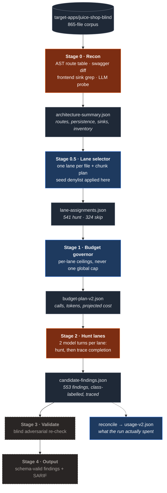

# Cybersecurity Coding Agent Harness

**A five-stage LLM harness that finds OWASP-categorized vulnerabilities in a
real codebase by reasoning about it, not by matching patterns — and reports
every number next to the defect that qualifies it.**

On OWASP Juice Shop (865-file corpus, 541 per-file hunt lanes, a fixed 97-entry
ground truth held in a separate private repository):

| | Result | Target |
|---|---|---|
| **Recall** — correct file, **exact line**, correct OWASP class | **71.1%** (69/97) | ≥90% |
| **Localization** — correct file, within ±15 lines, correct class | **88.7%** (86/97) | ≥90% |
| **File-level** — the right file, any line, any class | **100%** (97/97) | — |
| **Cost / wall clock** | **$4.37**, **13m04s** at concurrency 32 | — |

Scored blind: the harness has never had access to the answer key, and neither
has any agent that wrote its code. Three inference models have been run through
the identical pipeline on identical prompts (§5). The scanner is built and
measured; the patcher and verifier are designed and not built (§8).

> **§1 is a draft.** The one-liner and the exact metrics to lead with are the
> one open item in the README plan — see the PR description for alternatives.

---

## Contents

1. [Headline](#cybersecurity-coding-agent-harness)
2. [The problem](#2-the-problem)
3. [Architecture](#3-architecture)
4. [Project structure and engineering process](#4-project-structure-and-engineering-process)
5. [Results and benchmarking](#5-results-and-benchmarking)
6. [Technical challenges encountered](#6-technical-challenges-encountered)
7. [Running it](#7-running-it)
8. [Known limits](#8-known-limits)

---

## 2. The problem

Two failure modes motivated this architecture, and both were measured before any
of it was written. In July 2026 five existing open-source AI security scanners
were run against a 10-challenge subset of the same app
(`results/archive/2026-07-five-tool-benchmark/`).

**Pattern matching misses the classes that need semantics.** The one tool run as
a pure static-pattern scan (Semgrep rules, no agentic pass) reached **20% recall
and 50% localization** — 2 of 10 challenges. It found the SSRF and, via a generic
hardcoded-secret rule, one file. It found none of the access-control, auth-bypass
or prompt-injection challenges. Those defects are not textual; they are a missing
check, a trusted parameter, an ordering. A rule cannot express "this endpoint
authenticates but never authorizes" — reading the code can.

**Naive LLM scanning fails on budget and time, not on reasoning.** Two of the
five tools produced no scoreable output at all, and neither failure was a
reasoning failure:

- one hit an org-wide monthly spend cap mid-scan and exited before writing a
  report; it was scored from partial per-partition files left on disk;
- one timed out at stage 4 of 11 — its own estimator correctly predicted ~4M
  input tokens per pass across 9 detection stages, reported that, and then ran
  until the clock killed it anyway.

The lesson taken forward is structural: **per-lane budget ceilings rather than a
single global cap**, so one expensive unit of work cannot starve the rest, and
**a budget stage that stops rather than merely predicts**. Both live in Stage 1.
The ≥95% precision / ≥90% recall / ≥90% localization targets used throughout
this repo also come from that benchmark.

That archive is superseded as a *measurement* — it scored a 10-entry ground
truth against today's 98 — but it is the provenance for decisions still in
force, which is why it is kept and marked rather than deleted.

---

## 3. Architecture

Five stages. Each writes an artifact the next one reads; nothing is passed in
memory across a stage boundary, so any stage can be re-run, inspected or
replaced independently.

**Only Stages 0 and 2 make model calls.** Lane selection and budgeting are plain
TypeScript, which is why the same recon output always produces the same lane
manifest and the same projection — the expensive, non-deterministic part of the
pipeline is bounded to two stages.



<sub>**Orange = calls a model. Blue = deterministic code. Grey dashed = built but
not on the current path (Stage 3) or not built (Stage 4) — see §8.**</sub>

| Stage | Input | Output | Kind |
|---|---|---|---|
| **0 · Recon** | target repo root | `architecture-summary.json` — route table (hand-written, middleware, auto-CRUD with per-model exclude lists), persistence layer, dependencies, swagger-vs-actual diff, client-side render sinks, file inventory | **LLM** for tool-calling detection and category applicability; AST/grep for the rest |
| **0.5 · Lane selector** | `architecture-summary.json` | `lane-assignments.json` — one lane per inventory file, carrying the vulnerability classes recon's evidence associates with that file, plus a chunk plan covering the whole file | deterministic |
| **1 · Budget governor** | lane assignments + on-disk file sizes | `budget-plan-v2.json` — projected calls, input, output, cost for the selected arm | deterministic (arithmetic) |
| **2 · Hunt lanes** | one file per lane + its assigned classes' playbooks + arch/route context | `candidate-findings.json` — findings with a class label, a confidence, and a line-level trace | **LLM**, 2 turns per lane |
| **3 · Validate** | one consolidated finding's claim | `validated-findings.json` | **LLM** — v1 only, see §8 |
| **4 · Output** | Stage 3 verdicts | schema-valid `findings.json` + SARIF projection | not built |

**Why one lane per file.** The first architecture used one lane per *category
theme*, seeded with many files. Two defects made it unfixable: seed files were
truncated at 15,000 characters — the main server file is 2.7× that and was seeded
to every lane, so five ground-truth entries were physically unreachable — and
every finding inherited its lane's entire category list, so a finding of one
class carried the labels of several others. One lane per file makes coverage
provable from the manifest and forces the model to label its own finding.

**The lane loop.** Stage 2 is two turns in one conversation per chunk: a hunt
turn, then a follow-up that completes each finding's trace. The arm is
`HUNT_LOOP` (`none` | `trace` | `gap` | `reflect` | `sweep`); `trace` is shipped.
It exists because the dominant residual after five runs was `LINE_MISS_NEAR` —
the model reading the right code and citing a line 1–5 away from the defect.
That pool halved (28 → 14) when the loop shipped.

**Classes, not categories.** A 14-class registry (`shared/vuln-classes.json`)
maps to 25 OWASP codes, with one playbook per class. A finding may carry more
than one class — a single line can genuinely be both an injection and an
authentication failure — and the number of classes per finding is tracked as
*hedging*, so "found it by labelling everything" is visible rather than
rewarded.

Design intent is in `docs/architecture/`; the per-stage reference — exact inputs,
outputs, which source file, which parts are code and which are model calls — is
in `docs/stages/`.

---

## 4. Project structure and engineering process

The layout below is a consequence of how the project was run. Three constraints
shaped every choice: results must be blind, results must be reproducible from
artifacts rather than from anyone's report, and no paid run may be lost.

```
CLAUDE.md                    operating contract — read first, enforced, not advisory
docs/
  orientation.md             15-minute entry point for a new person or agent
  run-history.md             every scored run, newest first, aggregates only
  benchmarking-results.md    the append-only cross-model ledger
  architecture/              design intent
  protocols/                 process that outlives any one component
  stages/                    per-stage reference: in, out, code vs. LLM
  analysis/                  investigation write-ups (aggregates; located
                             evidence lives in the answer-key repo)
prompts/dispatch/            the written work spec for each change, dated
results/
  eval-history/*.jsonl       append-only, one line per evaluated run — the
                             source of truth everything else derives from
  archive/                   superseded results, each with a README saying
                             what replaced it
tools/
  scanner/                   the pipeline: stage0-recon … stage3-validate
    shared/                  registry, run paths, read guard, guard.test.ts
    runs/<provider>/<stage>/ per-model artifact namespace — never shared
  scan-benchmark/            scoring
  eval/                      cost model, usage aggregation, report generation
  blind-development/         split_answer_key.py — produced the two halves
target-apps/
  juice-shop/                working copy: answer-key markers removed
  juice-shop-blind/          + challenge categories neutralized — what is scanned
```

**Two repositories, split mechanically.** A pristine Juice Shop clone was split
once by `tools/blind-development/split_answer_key.py`. The working copy keeps the
vulnerabilities and loses the giveaways: 174 `vuln-code-snippet` tags across 14
files, the codefixes minigame data, `SOLUTIONS.md`, the refactoring-safety-net
tooling, two test files that embed exact vulnerable line numbers as their
"correct" answers, and 95 `solveIf()` oracle call sites whose criteria are
replaced with `() => false` — the calls themselves left intact so the app still
runs. A further copy neutralizes the `category` field on all 113 challenges, so
class assignment must come from reading code rather than from a label in a config
file. Everything removed went to a separate private repository, opened once per
run in a final scoring step. Because the split is mechanical, re-running it
against a fresh clone reproduces it exactly.

**`CLAUDE.md` as an enforced operating contract.** Every rule in it traces to a
specific incident, and the file says which. It fixes the role split — one party
writes the scanner, a different party verifies its results, because the party
that verifies should not be the party that produced. It names the change-safety
invariants (artifacts addressed through `runPath()`, never a path literal; no
model id, endpoint or credential outside `models.json`; v1 preserved exactly
while v2 is developed). It is read before anything else, by agents and people
alike.

**Docs are tiered by lifetime, not by topic.** `architecture/` is design intent,
`protocols/` is process that outlives any one component, `stages/` is the
practical per-component reference. `orientation.md` and `run-history.md` sit at
the top because they are the two documents most often wanted first.

**Dispatch briefs are written work specs.** Each change was specified in a dated
brief in `prompts/dispatch/` before implementation. They are never read at
runtime — which is exactly the trap they created once, and §6 covers it.

**An operational runbook with pre-run verification.**
`docs/protocols/running-a-scan.md` is ordered, and its first step is *verify the
tree, not the intent*: confirm each change you believe is in force by grepping
the file it lives in, not by finding its brief on disk. Steps 2–4 clear the
Stage 2 checkpoint, probe the provider, and confirm the corpus. Step 7 is
*verify before believing* — read `meta.json`, the coverage ledger, and the
consumption entries before reporting anything.

**Run archiving, because the next run overwrites in place.** Stage outputs are
written to a fixed path per provider and stage. An unarchived run is
unrecoverable, and one has already been lost this way (~3M tokens). An
`archive-run` skill captures stage outputs, logs and eval detail into the private
store and appends the eval-history record before the next run starts.

**Append-only ledgers.** `results/eval-history/*.jsonl`,
`docs/run-history.md` and `docs/benchmarking-results.md` are never rewritten.
Each row cost a paid run and cannot be reconstructed. When a number is later
found wrong — as the cost figures were, §6 — a correction is added beneath it
and the original stays. `guard.test.ts` asserts the benchmarking file still
records every model listed in it, so a deletion fails the suite instead of
passing quietly.

**A guard suite enforcing the invariants.** `tools/scanner/shared/guard.test.ts`
carries ~80 assertion sites (more at runtime — the registry-contract block
iterates every configured model) covering the read allowlist and its traversal
escapes, the model-registry contract for every entry, price and `price_asof`
presence, and the property that no lane manifest on disk assigns a denylisted
file to a hunt lane.

**The blind boundary is one of the guarantees this structure buys.** The rule is
that nothing pairing a challenge identifier with a file or a line may exist
anywhere the scanner or its coding agent can read. The reads themselves fail
closed: every stage goes through `readCorpusFile()`, whose allowlist is confined
to the two target-app trees, and every stage records `blocked_reads` in its
`meta.json`. The boundary has been breached four times — committed benchmark
output that listed challenge identifiers next to hit/miss status; a protocol doc
naming challenge keys beside their source files; a v2 component forked from v1
before the seed denylist moved into `shared/`, which sent a file that is 114
lines of literal challenge keys into a hunt prompt; and an eval write-up that
quoted ground-truth source lines verbatim. All four are recorded, in the open, in
`CLAUDE.md`, with what changed as a result. The third invalidated two runs, which
are marked *not blind — do not cite* in `run-history.md` rather than quietly
dropped.

---

## 5. Results and benchmarking

Every ground-truth-denominated figure below is over the **97 reachable** entries
of a 98-entry key. One entry sits in a file on the seed denylist that no finding
can ever cite — unreachable by construction, a cost of the blind boundary rather
than a scanner failure. Reporting it as a miss understated every run by ~1 point
and put an unattainable point between the scanner and the ≥90% target.

### (a) Iteration trajectory

Six scored runs of the v2 per-file pipeline, all on `luna` (GPT-5.6 Luna).

| Metric | Run 1 | Run 2 | Run 3 | Run 4 | Run 5 | **Run 6** |
|---|---|---|---|---|---|---|
| Recall (file + exact line + class) | 38.1% | 33.0% | 50.5% | 29.9% | 43.3% | **71.1%** |
| Localization (±15 lines) | 67.0% | 58.8% | 75.3% | 49.5% | 80.4% | **88.7%** |
| File-level (any line) | 95.9% | 100% | 100% | 99.0% | 100% | **100%** |
| Precision proxy (class-aware) | 15.4% | 11.9% | 11.8% | 12.2% | 12.5% | 12.5% |
| Hedging (classes/finding) | 1.462 | 1.240 | 1.538 | 1.312 | 1.518 | **1.418** |
| Findings | 247 | 354 | 407 | 311 | 392 | 553 |
| Lanes emitting ≥1 finding | 33.6% | 42.1% | 46.2% | 37.3% | 45.1% | **49.5%** |
| Tokens | 3.34M | 4.02M | 3.56M | 3.91M | 3.79M | 9.62M |
| Cost | $0.93 | $1.16 | $1.10 | $1.29 | $1.15 | $4.37 |
| Wall clock | — | — | 17m12s @ C=4 | 19m23s @ C=4 | 4m38s @ C=16 | 13m04s @ C=32 |
| Retries / fatal | — | — | 54 / 0 | 27 / 0 | 0 / 0 | **0 / 0** |

**What changed between runs.** Runs 1–3 built out the per-file architecture and
the class registry; run 4 tested a mandatory per-class sweep, regressed, and was
reverted (§6); run 5 fixed three playbook coverage gaps; run 6 shipped the
two-turn `trace` loop with
`reasoning_effort: high` and a raised output cap. Runs 5 and 6 reuse run 3's
Stage 0 and 0.5 artifacts unchanged, so the lane manifest and per-lane class
assignments are identical and the comparison is single-variable in Stage 2's arm.

Three qualifications travel with this table and are not footnotes:

- **Costs are restated.** Every dollar figure published before 2026-08-01 was
  computed at $1.00/$6.00 per MTok against a real rate of $0.20/$1.20 — 5× high.
  Run 6 was first reported at $21.84. Token counts were always measured and never
  changed, so no architectural conclusion moves. See §6.
- **Recall is location-weighted.** The 97 entries sit at 66 distinct locations and
  the three most crowded carry 24 between them. Between runs 2–5 that alone
  swings the headline by up to ~10 points; excluding those three lines, run 3's
  50.5% becomes 34.2% and is no better than run 2's. Run 6's 69 hits span **40 of
  66 distinct locations** against run 5's 42 hits over 23, which is why its gain
  reads as broad rather than lucky.
- **Recall is monotone in cited lines, so run 6 carries a budget-matched null.**
  Run 6 cites 881 distinct lines in the benchmark-bearing lanes (20.8% of their
  4,245) against run 5's 244. Inflating run 5's own findings mechanically to the
  same 881-line budget, with no model involved, reaches 59.8% recall. So of run
  6's +27.8 points, **+16.5 is line count and +11.3 is attributable**; of its
  +8.3 localization points, +5.2 is attributable. Read the attributable figures
  when comparing architectures and the headline when reporting what the scanner
  produced — both are true, neither alone is.

A separate correction applies to runs 1–5: a line-count desync (§6) cost ~3
exact-line hits in each. Re-scoring run 5 with it corrected gives 46.4% against
the published 43.3%. Runs 1–5 are left as published, per the never-rewrite rule.

### (b) Cross-model benchmarking

Identical prompts, identical lane manifest, identical corpus, identical scorer
and denominator. The only permitted differences are the ones the model registry
declares — everything else and you are comparing two codebases rather than two
models. All three use the v2 per-file pipeline at `HUNT_LOOP=trace`,
`reasoning_effort: high`, `max_output_tokens: 64000`, 541/541 lanes, 1,082 calls.

| Metric | `luna` (GPT-5.6 Luna) | `glm52` (GLM-5.2) | `gemini36flash` (Gemini 3.6 Flash) |
|---|---|---|---|
| **Recall** (file + exact line + class) | **71.1%** (69/97) | 67.0% (65/97) | 58.8% (57/97) |
| Recall, class-blind | 79.4% | 79.4% | 69.1% |
| **Localization** (±15 lines) | **88.7%** (86/97) | 85.6% (83/97) | 75.3% (73/97) |
| Localization, class-blind | 95.9% | 93.8% | 91.8% |
| File-level | 100% | 100% | 99.0% |
| **Precision proxy**, class-aware | 12.5% (69/553) | 7.8% (70/892) | **16.5%** (47/285) |
| Findings emitted | 553 | 892 | 285 |
| Hedging (classes/finding) | **1.418** | 1.459 | 1.512 |
| Distinct lines cited | 3,597 | 4,577 | 1,181 |
| Mean / max trace steps | 8.74 / 51 | 6.64 / 38 | 4.56 / 13 |
| Total tokens | 9.62M | 9.67M | 9.38M |
| **Cost** | **$4.37** | $17.01 | $24.85 |
| **Runtime** | **13m04s** at C=32 | ~18.5m at C=32 | 32m12s at C=8 |

**What the spread shows.** Class-blind recall is identical for the top two
(79.4%) while class-aware recall differs by 4 points — the gap is in labelling,
not in finding. The three models sit within 3% of each other on total tokens and
span **5.7× on cost**, which is a pricing property rather than a capability one.
Gemini's concurrency of 8 is a measured ceiling on this target, not a
configuration choice, and it is why its runtime is 2.5× Luna's on fewer tokens.
Precision proxy inverts the recall order: the model emitting the fewest findings
has the best ratio and the worst recall.

Per-class recall for each model is in `docs/benchmarking-results.md`, which is
the append-only ledger every model's run writes into, with the rules a row must
satisfy to be recorded. Four further models are staged and on hold.

**Architectural provenance.** The five-tool external comparison in §2
(`results/archive/2026-07-five-tool-benchmark/`) is the origin of the targets and
of three design decisions, and is deliberately **not** comparable to the tables
above — it scored 10 ground-truth entries where these score 97.

---

## 6. Technical challenges encountered

Each of these was found by measurement, not by review, and each changed
something. They are here because the investigation method is the transferable
part.

### A line-count desync that no metric could see

**Problem.** Recall was stuck while localization improved — the signature of
findings landing near the defect but never on it.

**Investigation.** A 40-lane measurement platform was built after confirming
that all 97 reachable entries live in 40 of the 541 lanes, and that restricting
run 5's own findings to those 40 lanes reproduces its published metrics exactly.
The arm builder asserted prompt fidelity per lane against run 5's recorded
character counts: 39 of 40 byte-identical, one drifting by 9–108 characters.
Chasing that drift found the defect.

**Resolution.** `sanitizePemPrivateKey()` — part of the blind-split redaction —
replaced a one-line PEM key declaration with a three-line placeholder. Every line
number the model saw below that point was 2 higher than the number the scorer
read. A 2-line shift is invisible to a ±15-line window and fatal to exact-line
recall.

**What it changed.** ~3 exact-line hits in every run 1–5; re-scoring run 5
corrected gives 46.4% against 43.3%. Fixed with 7 regression tests. The
generalizable lesson: **any transform that changes line counts between what the
model reads and what the scorer reads is invisible to every localization metric
you have** — assert prompt fidelity byte-for-byte, per unit of work.

### Concurrency versus rate limits, and lanes that vanish

**Problem.** A run at concurrency 8 lost 52 of 541 lanes. A failed lane is not
just a gap: a second pass triggers a defect where `laneRecordsV2` is not restored
from the checkpoint, so the consumption rollup covers only the final pass — on
one run it understated the total by ~6×.

**Investigation.** Throughput was measured per unit of concurrency rather than
assumed: run 3 gave ~51,700 TPM per unit at default effort. That figure then
failed to carry to the high-effort arm, and re-measuring on the 40-lane platform
gave ~16,000 — a third of it, because a high-effort call spends far longer
producing far more tokens.

**Resolution.** Concurrency is *derived*, not copied: `C = (target share of the
TPM ceiling) / (measured TPM per unit for this arm)`, targeting 40–50% of the
ceiling rather than 90%, because lanes do not arrive uniformly. `maxRetries` went
3 → 5 and the backoff cap 15s → 60s, so the waits (2+4+8+16+32 = 62s) cross a
full TPM window; no individual backoff had ever been too short, but three retries
could not outlast a sustained saturation period.

**What it changed.** Run 5 onward: 0 fatal lanes. Run 6 ran 541/541 at
concurrency 32 with 0 retries. The runbook now says to re-derive the number
rather than reuse one, because the rate limit has already moved by 10×.

### A 429 that was not a rate limit

**Problem.** A full-pipeline run died, and a model-tier arm on a larger model
failed, both throwing HTTP 429. The obvious reading — rate limiting — was
recorded, and it was wrong.

**Investigation.** Reading the response bodies instead of the status codes: all
248 of them carried `You have no credits remaining`.

**Resolution and what it changed.** The record was corrected — three model
targets are *unmeasured for a billing reason, not a capability one*, which is a
materially different statement about the architecture. The earlier attribution to
rate limiting is left in place with the correction beneath it. The lesson is
narrow and sharp: **a status code is not a diagnosis.**

### A location-weighted metric producing ~10 points of phantom variance

**Problem.** Run 3 had the best recall and run 5 the best localization, and the
two facts appeared to conflict.

**Investigation.** Recall was decomposed by ground-truth location rather than by
class. The 97 entries sit at 66 locations, and three of them carry 24 entries
between them — whether those 24 score turns on whether one finding at each
carries one class label.

**Resolution.** Run 3 drew all 24 and run 5 drew 16; that −8 is the entire recall
delta between them. Excluding those three lines, run 3's recall (34.2%) is *no
better* than run 2's (35.6%), while run 5 matches run 2 and localizes far better
(74.0% vs 58.9%).

**What it changed.** Every comparison now reports the excluding-them column and
distinct locations covered alongside the headline, and a **±7-entry
nondeterminism floor** on byte-identical prompts is treated as the threshold
below which nothing is a result. It is also why run 6's claim rests on *40 of 66
distinct locations* rather than on 71.1%.

### An experiment that hit 100% conformance and moved nothing

**Problem.** A persistent `FILE_ONLY` bucket — 13 entries where a finding sits in
the right file but never within ±15 lines carrying the right class. The reading:
lanes are assigned many classes and answer about only two or three, so per-class
coverage is the gap. Run 3 assigned a mean of 5.55 classes per lane and the model
emitted 2.01; no lane out of 250 emitted every class it was assigned.

**Investigation.** Run 4 made coverage mandatory and instrumented — a
`class_sweep` array declared *before* `findings` in the strict schema, a prompt
procedure requiring one verdict per assigned class before any finding may be
written, and five mechanical invariants recorded per lane in a new artifact.

**Resolution.** Conformance was perfect and the hypothesis was still false.
**541/541 lanes, 3005/3005 lane-class pairs swept (100%)**, zero missing,
off-list, duplicate, inconsistent or found-without-finding. **`FILE_ONLY` did not
move: 13 → 13.** Driving per-class coverage from an implicit ~17% to an explicit
100% converted nothing — and recall fell 20 hits, because the sweep became a
*gate* rather than a check: an early cheap "absent" verdict hard-blocked
labelling that class later, so `CATEGORY_MISS` rose +18. F3 was reverted and run
3's artifacts restored.

**What it changed.** The premise was recorded as falsified so it would not be
re-attempted, and the same pattern was found again immediately afterward: a
matched A/B on windowing long files into multiple lanes raised findings per file
39% and trace lines 35%, doubled the files with ≥3 findings — and left class-aware
localization *identical* (25/42 in both arms) while class-blind localization
fell. Windowing produced more findings about what the model already reports.
**A mechanism confirmed to work is not a cause confirmed to matter**, and the
only thing that separates them is a control arm. The lever that did move both
halves of the gap came out of the same investigation: fewer classes per lane,
18/19 against 13/19, never losing a probe the full list wins.

---

## 7. Running it

### Prerequisites

Node 20+ with `tsx`, Python 3 for scoring, and an API key for whichever provider
you select, exported under the env var that provider's registry entry names
(`OPENAI_API_KEY` for `luna`, and so on). No key, endpoint or model id is stored
in this repository.

### Quickstart

```bash
# 0. Confirm the provider is reachable — costs a few tokens, exits non-zero on failure
cd tools/scanner/stage3-validate
NODE_USE_ENV_PROXY=1 SCANNER_PROVIDER=luna npx tsx ../shared/preflight.ts

# 1. Check the invariants
cd ../stage2-hunt-lanes-perfile && npx tsx ../shared/guard.test.ts

# 2. Run a stage, or the whole v2 pipeline
./tools/scanner/run.sh <provider> <stage|all-v2>
```

Stage order for v2:

```
stage0-recon → stage05-lane-selector-perfile → stage1-budget-governor-perfile
             → stage2-hunt-lanes-perfile → reconcile-v2
```

Stage 2 outlives a terminal session, so detach it:

```bash
HUNT_CONCURRENCY=16 setsid nohup \
  ./tools/scanner/run.sh luna stage2-hunt-lanes-perfile > stage2.log 2>&1 &
```

**Stage 2 resumes from its own output directory.** Leaving a previous run's
`candidate-findings.json` in place makes it skip every lane and report success
with stale results, and the log looks completely normal. Archive, then clear it.
The full ordered procedure — including *verify the tree, not the intent* — is
`docs/protocols/running-a-scan.md`.

### The model registry

Models are data. `tools/scanner/shared/models.json` is the single source of
truth, and nothing under `tools/scanner/*/src/` names a model, an endpoint or a
credential. **Adding a model is one JSON entry and no code change:**

```jsonc
"terra": {
  "label": "GPT-5.6 Terra",
  "model": "gpt-5.6-terra",
  "model_env": "TERRA_MODEL",
  "api_key_env": "OPENAI_API_KEY",
  "base_url": null,
  "base_url_env": "OPENAI_BASE_URL",
  "token_limit_param": "max_completion_tokens",
  "sampling": {},
  "max_output_tokens": 64000,
  "price_per_mtok": { "input": 2.0, "output": 12.0 },
  "price_asof": "2026-08-01"
}
```

Provider-specific API differences are declared here and resolved through helpers
— there is no `if (provider === …)` anywhere outside `shared/`, and adding one
breaks the property that makes cross-model comparison meaningful. A provider key
is also its artifact namespace (`runs/<key>/<stage>/`), so key on the **model**,
not the vendor: one endpoint serves several models and each needs an isolated
tree. Price lives beside the model id with a `price_asof` date, because when it
lived in prose instead it rotted there and five runs published costs 5× high.
`guard.test.ts` asserts both fields are present.

Resolution order: `SCANNER_PROVIDER_<STAGE>` → `SCANNER_PROVIDER` →
`default_provider`.

### Deriving concurrency

Do not copy a number out of a doc — the rate limit has already changed by 10×.
Measure TPM per unit of concurrency for the arm you are running, then:

```
C = (target share of the TPM ceiling) / (measured TPM per unit)
```

Target **40–50%** of the ceiling, not 90%: lanes do not arrive uniformly and a
batch of large files landing together spikes well above the mean. Measured
values for the shipped high-effort `trace` arm are ~16,000 TPM per unit, against
~51,700 at default effort — the two do not substitute.

### Selecting the Stage 2 arm

The shipped arm is the default and needs no env var. Four variables change what
Stage 2 does **without changing the tree**, so the git SHA does not identify a
run; all four are recorded in `meta.json`.

| Variable | Default | Effect |
|---|---|---|
| `HUNT_LOOP` | `trace` | `none` \| `trace` \| `gap` \| `reflect` \| `sweep` |
| `HUNT_LOOP_PASSES` | `1` | follow-up turns per chunk; stops early on an unproductive turn |
| `SCANNER_REASONING_EFFORT` | registry (`high`) | `low` \| `medium` \| `high`, or empty to send none |
| `SCANNER_MAX_OUTPUT_TOKENS` | registry (64000) | **must move with the effort** |

That last pairing is the one to get right. At `reasoning_effort: high`, a cap of
8,000 truncates 42% of lanes, and a truncated body is unparseable JSON that
Stage 2 records as *a lane that found nothing* — measured recall 63.9% → 37.1%
with nothing in the log to say why.

To reproduce runs 1–5: `HUNT_LOOP=none SCANNER_REASONING_EFFORT=
SCANNER_MAX_OUTPUT_TOKENS=8000`.

---

## 8. Known limits

**The measurement is n=97 on one application.** Every number in §5 is Juice
Shop. The pipeline is target-agnostic by construction — Stage 0 derives its
architecture summary from the tree it is pointed at, and the corpus path is a
parameter — but that generality is untested. A second target is the single
highest-value thing that could be added.

**Public-corpus pretraining is an unquantified confound.** Juice Shop is one of
the most widely mirrored codebases on the internet and every model here was
trained on data that almost certainly includes it, along with write-ups of its
challenges. The blind split removes the in-repo giveaways; it cannot remove what
a model already knows. Cross-model comparison is unaffected — all three models
face the same confound — but the absolute level is an upper bound on what the
same architecture would do against code the model has never seen.

**The ≥90% targets are not met.** Recall 71.1% against ≥90%, localization 88.7%
against ≥90%. Two structural caps are known and quantified: 5 of the residual
`LINE_MISS_NEAR` entries have a ground-truth line that is blank,
punctuation-only, or a comment and is therefore not citable at all, which caps
exact-line recall near 94%; and one entry is unreachable by the seed denylist,
which is why the denominator is 97. `ai-llm-agency` remains at or near 0/4 across
every run to date.

**v2 has no validator stage, so precision is unrecovered.** Stage 3 exists and
works, but it consumes v1's Stage 2 output and its committed results predate both
the v2 architecture and the target-app cleanup — treat any number from it as
stale. Nothing downstream of v2's Stage 2 filters findings, which is why the
precision proxy sits at 7.8–16.5% against a ≥95% target. That figure is a
*proxy*: it counts a finding as correct only if it matches a ground-truth entry,
so genuine vulnerabilities outside the 97-entry key are scored as false
positives. The real precision is higher by an unknown amount, and no honest
number for it exists without hand-adjudicating several hundred findings.

**Stage 4 is not built**, so there is no schema-validated or SARIF output; the
pipeline's terminal artifact is `candidate-findings.json`.

**The patcher and verifier are designed, not built.** The stated goal — fix every
real instance of a class and prove both that the exploit no longer works and that
functionality is unchanged — has a ground-truth schema and an agent-facing
contract, and no implementation.

---

## Documentation

| You want to… | Read |
|---|---|
| Get oriented in 15 minutes | `docs/orientation.md` |
| Know the rules that must not be broken | `CLAUDE.md` |
| Run a scan end to end | `docs/protocols/running-a-scan.md` |
| Score a run and compare it to the last | `docs/protocols/eval-howto.md` |
| See every run and what it showed | `docs/run-history.md` |
| Compare models | `docs/benchmarking-results.md` |
| Add or switch an inference model | `docs/architecture/multi-model-architecture.md` |
| Understand what one stage reads and writes | `docs/stages/<stage>.md` |
| Understand what the scanner may never see | `docs/protocols/blind-development.md` |

## Target application

[OWASP Juice Shop](https://github.com/juice-shop/juice-shop) — a full-stack,
deliberately vulnerable e-commerce application (Express/TypeScript backend,
Angular frontend) with 113 documented challenges across the OWASP Top Ten.
Vendored under `target-apps/` and used under its own license.
