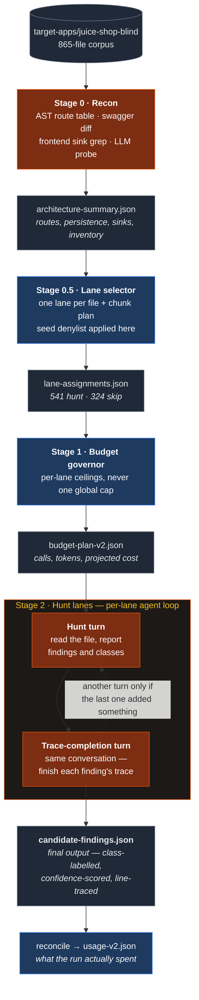
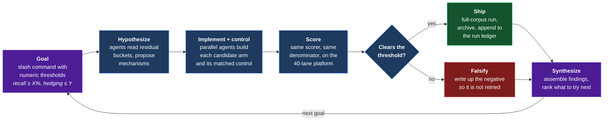

# Cybersecurity Scanner AI Agent Harness

**An AI agent harness that scans a codebase for an entire class of
OWASP-categorized vulnerabilities and reports it.**

On OWASP Juice Shop (865-file corpus, 541 per-file hunt lanes, a fixed 97-entry
ground truth held in a separate private repository):

| | Result |
|---|---|
| **Recall** — correct file, **exact line**, correct OWASP class | **71.1%** (69/97) |
| **Localization** — correct file, within ±15 lines, correct class | **88.7%** (86/97) |
| **File-level** — the right file, any line, any class | **100%** (97/97) |
| **Cost / wall clock** | **$4.37**, **13m04s** at concurrency 32 |

Scored blind: the harness has never had access to the answer key, and neither
has any agent that wrote its code. Four inference models have been run through
the identical pipeline on identical prompts, lanes and corpus (§5).

---

## Contents

1. [Headline](#scanner-ai-agent-harness)
2. [The problem](#2-the-problem)
3. [Architecture](#3-architecture)
4. [Project structure and engineering process](#4-project-structure-and-engineering-process)
5. [Results and benchmarking](#5-results-and-benchmarking)
6. [Technical challenges, and how they were investigated](#6-technical-challenges-and-how-they-were-investigated)
7. [Running it](#7-running-it)

---

## 2. The problem

### 2.1 Vulnerable source code is now the primary attack surface

The costliest breaches of the last few years did not start with a stolen
password. They started with a defect sitting in source code that had already
passed review. Log4Shell (CVE-2021-44228) was a lookup feature in a logging
library that let a formatted string reach a JNDI resolver, and it put hundreds of
millions of devices in scope within days. The Cl0p group's 2023 campaign against
MOVEit Transfer (CVE-2023-34362) was a **SQL injection** — a textbook class,
decades old, in a widely deployed file-transfer product — and it cascaded into
data loss at thousands of downstream organizations. The XZ Utils backdoor of 2024
(CVE-2024-3094) went further still: malicious logic deliberately staged into a
compression library over the course of two years, caught by a maintainer chasing
a fraction of a second of SSH latency rather than by any scanner.

Those three are the pattern the industry now lives with. Software is assembled
from far more code than any team reads, shipped far faster than any team can
audit it, and a single reachable defect in a dependency is a supply-chain
incident for everyone downstream. Meanwhile the defect classes that dominate real
incident reports — broken access control, authentication and identity failures,
insecure design — are precisely the ones no rule can describe, because the bug is
something *absent*: a check that was never written, a parameter nobody thought to
distrust, two operations in the wrong order.

### 2.2 What AI is being asked to do about it, and how

Conventional tooling splits the work and drops the middle. **SAST** reads code
without running it and is fast, cheap and repeatable — and its rules only match
what someone already knew to write a rule for, which is why teams drown in
findings while the interesting bugs stay quiet. **DAST** exercises a running
system and proves exploitability, but only for the paths it happens to reach, and
it points at a URL rather than a line. **Fuzzing** is extremely effective at
memory-safety and parser defects and largely mute on business logic. None of them
can reason about intent, and intent is where the expensive bugs live.

Several distinct AI-based approaches are being applied to exactly that gap:

| Approach | What it does | Where it fits |
|---|---|---|
| **LLM-assisted triage** | Ranks and explains the output of existing SAST/DAST tooling | Cuts alert fatigue; cannot find what the underlying tool never flagged |
| **LLM-guided fuzzing** | Uses a model to write harnesses and seed inputs, then runs a real fuzzer | Strong on memory safety and parsers; needs an executable target |
| **Code-embedding retrieval** | Finds code semantically similar to known-vulnerable patterns | Good recall on *recurrences* of known bugs; weak on novel logic flaws |
| **Autonomous exploitation agents** | Reason about a running target and attempt real exploits | Proves impact end to end; expensive, and needs a deployable environment |
| **Agent harnesses over source** ← *this project* | Decompose a repository into bounded units of work, reason over each with an LLM, and emit located, classified, evidence-backed findings | Reads intent the way a reviewer does, at a cost and runtime that can be budgeted per unit |

An agent harness is the approach that most directly targets the failure mode
above, because it does the thing a rule cannot: read a file, hold the
application's architecture in context, and ask whether the code *should* have
done something it does not. The engineering problem is that reasoning is
expensive and non-deterministic, so an agent left to roam a repository burns an
unbounded budget and produces findings nobody can reproduce.

---

## 3. Architecture

Four stages, each writing an artifact the next one reads. Nothing crosses a stage
boundary in memory, so any stage can be re-run, inspected, scored or replaced on
its own — which is what makes each stage independently measurable rather than
only collectively runnable.

**Only Stages 0 and 2 make model calls.** Everything between them is plain
TypeScript, which keeps the expensive, non-deterministic part of the pipeline
bounded to two places.



<sub>**Orange = calls a model. Blue = deterministic code. Stage 2's two turns
share one conversation and repeat only while a turn is still adding
something.**</sub>

### 3.1 What each stage does, and why the pipeline needs it

**Stage 0 · Recon — turn an unknown repository into a fact sheet.**
A model cannot reason usefully about a single file without knowing what the
application *is*. Recon builds that context once: an AST pass extracts the route
table (hand-written routes, middleware, and auto-generated CRUD endpoints with
their per-model exclude lists — the mass-assignment signal), a diff compares the
declared API spec against the routes that actually exist, a frontend pass finds
the framework's escape hatches where markup bypasses sanitization, and a model
probe decides whether the app has agent/tool-calling surface at all. The output
is one JSON fact sheet that every later stage reads, so no other stage ever
re-parses raw source. Without it, each lane would be a file with no idea whether
it sits behind authentication, is reachable from the internet, or touches the
database.

**Stage 0.5 · Lane selector — cut the codebase into units of work.**
This is where "scan the repo" becomes a bounded, enumerable job. Every file in
the inventory becomes one lane, carrying the vulnerability classes recon's
evidence associates with *that* file plus a chunk plan covering it end to end.
Files with no plausible attack surface get a `skip` disposition rather than
silently disappearing, so coverage is provable by reading the manifest: hunt plus
skip must equal inventory, and anything unaccounted for is a defect. It also
applies the seed denylist, which keeps benchmark-infrastructure files out of
model context entirely.

**Stage 1 · Budget governor — know the cost before spending it.**
Pure arithmetic over the manifest and the on-disk file sizes: how many calls,
how many input and output tokens, what that costs at the selected model's rate.
A scan that discovers its own cost halfway through is a scan that dies halfway
through. Ceilings are per-lane rather than global, so one
pathological file cannot consume the budget for everything after it. The same
stage runs again after the scan, in reconcile mode, to record what was actually
spent — the projection and the measurement are separate artifacts and never
overwrite each other.

**Stage 2 · Hunt lanes — the actual vulnerability reasoning.**
Each lane binds the model to exactly one file, loads only the playbooks for that
file's assigned classes, and supplies the architectural and route context recon
found. The model reads the code and reports what is wrong with it: a title, the
classes it belongs to, a confidence, and a **trace** — the ordered file-and-line
path from entry point to sink that constitutes the evidence. Then the loop runs:
a second turn in the same conversation asks the model to complete traces it left
partial, and it stops early when a turn adds nothing. Findings are the
deliverable; the trace is what makes a finding checkable rather than an
assertion.

**Reconcile — close the loop on cost.**
Reads Stage 2's own consumption artifact and writes what the run spent, per lane
and in total, next to the rate that produced the number. It reports actuals only
and deliberately does not compare them to the projection: a gap between an
estimate and a measurement is a fact about the estimate, and the number wanted
afterwards is the cost.

`candidate-findings.json` is the pipeline's final output.

### 3.2 Inputs and outputs

| Stage | Input | Output | Kind |
|---|---|---|---|
| **0 · Recon** | target repo root | `architecture-summary.json` — route table (hand-written, middleware, auto-CRUD with per-model exclude lists), persistence layer, dependencies, swagger-vs-actual diff, client-side render sinks, file inventory | **LLM** for tool-calling detection and class applicability; AST/grep for the rest |
| **0.5 · Lane selector** | `architecture-summary.json` | `lane-assignments.json` — one lane per inventory file, carrying the classes recon's evidence associates with that file, plus a chunk plan covering the whole file | deterministic |
| **1 · Budget governor** | lane assignments + on-disk file sizes | `budget-plan-v2.json` — projected calls, input, output, cost for the selected arm | deterministic (arithmetic) |
| **2 · Hunt lanes** | one file per lane + its assigned classes' playbooks + arch/route context | `candidate-findings.json` — findings with class labels, a confidence, and a line-level trace | **LLM**, agent loop per lane |
| **reconcile** | Stage 2's consumption artifact | `usage-v2.json` — measured tokens and cost, per lane and total | deterministic |

### 3.3 Justifying the architecture

**Why one lane per file.** The first architecture used one lane per *category
theme*, seeded with many files. Two defects made it unfixable: seed files were
truncated at 15,000 characters — the main server file is 2.7× that and was seeded
to every lane, so five ground-truth entries were physically unreachable — and
every finding inherited its lane's entire category list, so a finding of one
class carried the labels of several others. One lane per file makes coverage
provable from the manifest, forces the model to label its own finding, and caps
the blast radius of any single failure at one file.

**Why the reasoning is bounded to two stages.** Stage 0.5 and Stage 1 are
deterministic on purpose. Lane assignment and cost projection are decisions that
must be *auditable* — you have to be able to answer "why was this file scanned
this way" without re-running a model — and they are the two places where
non-determinism would make every downstream comparison meaningless.

**Why a loop instead of a longer prompt.** A single turn asks the model to find
and fully evidence a vulnerability at once, and it reliably does the first well
and the second partially. Splitting into a hunt turn and a completion turn lets
the second turn work against concrete findings rather than against a blank file.
The arm is `HUNT_LOOP` (`none` | `trace` | `gap` | `reflect` | `sweep`) and
`trace` is shipped; the alternatives are kept because the loop is the most
promising place to keep experimenting.

**Why classes rather than OWASP categories.** A 14-class registry
(`shared/vuln-classes.json`) maps to 25 OWASP codes, with one playbook per class.
Classes are what a playbook can actually teach; OWASP codes are what a report has
to speak. A finding may carry more than one class — a single line can genuinely
be both an injection and an authentication failure — and classes per finding is
tracked as *hedging*, so "score well by labelling everything" shows up as a
number rather than as recall.

Design intent is in `docs/architecture/`; the per-stage reference — exact inputs,
outputs, which source file, which parts are code and which are model calls — is
in `docs/stages/`.

---

## 4. Project structure and engineering process

The layout below is a consequence of how the project was run. Three constraints
shaped every choice: results must be blind, results must be reproducible from
artifacts rather than from anyone's report, and no paid run may be lost.

```
CLAUDE.md                    operating contract — read first, enforced, not advisory
docs/
  orientation.md             15-minute entry point for a new person or agent
  run-history.md             every scored run, newest first, aggregates only
  benchmarking-results.md    the append-only cross-model ledger
  architecture/              design intent
  protocols/                 process that outlives any one component
  stages/                    per-stage reference: in, out, code vs. LLM
  analysis/                  investigation write-ups (aggregates; located
                             evidence lives in the answer-key repo)
prompts/
  dispatch/                  the written work spec for each change, dated
  runtime/                   prompt templates the scanner sends during a scan
results/
  eval-history/*.jsonl       append-only, one line per evaluated run — the
                             source of truth everything else derives from
  archive/                   superseded results, each with a README saying
                             what replaced it
tools/
  scanner/                   the pipeline: stage0-recon … stage2-hunt-lanes-perfile
    shared/                  registry, run paths, read guard, guard.test.ts
    runs/<provider>/<stage>/ per-model artifact namespace — never shared
  scan-benchmark/            scoring
  eval/                      cost model, usage aggregation, report generation
  blind-development/         split_answer_key.py — produced the two halves
target-apps/
  juice-shop/                working copy: answer-key markers removed
  juice-shop-blind/          + challenge categories neutralized — what is scanned
```

**Two repositories, split mechanically.** A pristine Juice Shop clone was split
once by `tools/blind-development/split_answer_key.py`. The working copy keeps the
vulnerabilities and loses the giveaways: 174 `vuln-code-snippet` tags across 14
files, the codefixes minigame data, `SOLUTIONS.md`, the refactoring-safety-net
tooling, two test files that embed exact vulnerable line numbers as their
"correct" answers, and 95 `solveIf()` oracle call sites whose criteria are
replaced with `() => false` — the calls themselves left intact so the app still
runs. A further copy neutralizes the `category` field on all 113 challenges, so
class assignment must come from reading code rather than from a label in a config
file. Everything removed went to a separate private repository, opened once per
run in a final scoring step. Because the split is mechanical, re-running it
against a fresh clone reproduces it exactly.

**`CLAUDE.md` as an enforced operating contract.** Every rule in it traces to a
specific incident, and the file says which. It fixes the role split — one party
writes the scanner, a different party verifies its results, because the party
that verifies should not be the party that produced. It names the change-safety
invariants (artifacts addressed through `runPath()`, never a path literal; no
model id, endpoint or credential outside `models.json`; v1 preserved exactly
while v2 is developed). It is read before anything else, by agents and people
alike.

**Docs are tiered by lifetime, not by topic.** `architecture/` is design intent,
`protocols/` is process that outlives any one component, `stages/` is the
practical per-component reference. `orientation.md` and `run-history.md` sit at
the top because they are the two documents most often wanted first.

**Dispatch briefs are written work specs.** Each change was specified in a dated
brief in `prompts/dispatch/` before implementation. They are never read at
runtime — which is exactly the trap they created once, and §6 covers it.

**An operational runbook with pre-run verification.**
`docs/protocols/running-a-scan.md` is ordered, and its first step is *verify the
tree, not the intent*: confirm each change you believe is in force by grepping
the file it lives in, not by finding its brief on disk. Steps 2–4 clear the
Stage 2 checkpoint, probe the provider, and confirm the corpus. Step 7 is
*verify before believing* — read `meta.json`, the coverage ledger, and the
consumption entries before reporting anything.

**Run archiving, because the next run overwrites in place.** Stage outputs are
written to a fixed path per provider and stage. An unarchived run is
unrecoverable, and one has already been lost this way (~3M tokens). An
`archive-run` skill captures stage outputs, logs and eval detail into the private
store and appends the eval-history record before the next run starts.

**Append-only ledgers.** `results/eval-history/*.jsonl`,
`docs/run-history.md` and `docs/benchmarking-results.md` are never rewritten.
Each row cost a paid run and cannot be reconstructed. When a number is later
found wrong — as the cost figures were, §6 — a correction is added beneath it
and the original stays. `guard.test.ts` asserts the benchmarking file still
records every model listed in it, so a deletion fails the suite instead of
passing quietly.

**A guard suite enforcing the invariants.** `tools/scanner/shared/guard.test.ts`
runs **256 assertions** covering the read allowlist and its traversal escapes,
the model-registry contract for every configured entry, price and `price_asof`
presence, line-number fidelity between what the model is shown and what the
scorer reads, transport sandboxing, and the property that no lane manifest on
disk assigns a denylisted file to a hunt lane.

**The blind boundary is one of the guarantees this structure buys.** The rule is
that nothing pairing a challenge identifier with a file or a line may exist
anywhere the scanner or its coding agent can read. The reads themselves fail
closed: every stage goes through `readCorpusFile()`, whose allowlist is confined
to the two target-app trees, and every stage records `blocked_reads` in its
`meta.json`. The boundary has been breached four times — committed benchmark
output that listed challenge identifiers next to hit/miss status; a protocol doc
naming challenge keys beside their source files; a v2 component forked from v1
before the seed denylist moved into `shared/`, which sent a file that is 114
lines of literal challenge keys into a hunt prompt; and an eval write-up that
quoted ground-truth source lines verbatim. All four are recorded, in the open, in
`CLAUDE.md`, with what changed as a result. The third invalidated two runs, which
are marked *not blind — do not cite* in `run-history.md` rather than quietly
dropped.

---

## 5. Results and benchmarking

### (a) Iteration trajectory

Six scored runs of the v2 per-file pipeline, all on `luna` (GPT-5.6 Luna).

| Metric | Run 1 | Run 2 | Run 3 | Run 4 | Run 5 | **Run 6** |
|---|---|---|---|---|---|---|
| Recall (file + exact line + class) | 38.1% | 33.0% | 50.5% | 29.9% | 43.3% | **71.1%** |
| Localization (±15 lines) | 67.0% | 58.8% | 75.3% | 49.5% | 80.4% | **88.7%** |
| File-level (any line) | 95.9% | 100% | 100% | 99.0% | 100% | **100%** |
| Precision proxy (class-aware) | 15.4% | 11.9% | 11.8% | 12.2% | 12.5% | 12.5% |
| Hedging (classes/finding) | 1.462 | 1.240 | 1.538 | 1.312 | 1.518 | **1.418** |
| Findings | 247 | 354 | 407 | 311 | 392 | 553 |
| Lanes emitting ≥1 finding | 33.6% | 42.1% | 46.2% | 37.3% | 45.1% | **49.5%** |
| Tokens | 3.34M | 4.02M | 3.56M | 3.91M | 3.79M | 9.62M |
| Cost | $0.93 | $1.16 | $1.10 | $1.29 | $1.15 | $4.37 |
| Wall clock | — | — | 17m12s @ C=4 | 19m23s @ C=4 | 4m38s @ C=16 | 13m04s @ C=32 |
| Retries / fatal | — | — | 54 / 0 | 27 / 0 | 0 / 0 | **0 / 0** |

**What changed between runs.** Runs 1–3 built out the per-file architecture and
the class registry; run 4 tested a mandatory per-class sweep, regressed, and was
reverted (§6); run 5 fixed three playbook coverage gaps; run 6 shipped the
two-turn `trace` loop with
`reasoning_effort: high` and a raised output cap. Runs 5 and 6 reuse run 3's
Stage 0 and 0.5 artifacts unchanged, so the lane manifest and per-lane class
assignments are identical and the comparison is single-variable in Stage 2's arm.

Three qualifications travel with this table and are not footnotes:

- **Costs are restated.** Every dollar figure published before 2026-08-01 was
  computed at $1.00/$6.00 per MTok against a real rate of $0.20/$1.20 — 5× high.
  Run 6 was first reported at $21.84. Token counts were always measured and never
  changed, so no architectural conclusion moves. See §6.
- **Recall is location-weighted.** The 97 entries sit at 66 distinct locations and
  the three most crowded carry 24 between them. Between runs 2–5 that alone
  swings the headline by up to ~10 points; excluding those three lines, run 3's
  50.5% becomes 34.2% and is no better than run 2's. Run 6's 69 hits span **40 of
  66 distinct locations** against run 5's 42 hits over 23, which is why its gain
  reads as broad rather than lucky.
- **Recall is monotone in cited lines, so run 6 carries a budget-matched null.**
  Run 6 cites 881 distinct lines in the benchmark-bearing lanes (20.8% of their
  4,245) against run 5's 244. Inflating run 5's own findings mechanically to the
  same 881-line budget, with no model involved, reaches 59.8% recall. So of run
  6's +27.8 points, **+16.5 is line count and +11.3 is attributable**; of its
  +8.3 localization points, +5.2 is attributable. Read the attributable figures
  when comparing architectures and the headline when reporting what the scanner
  produced — both are true, neither alone is.

A separate correction applies to runs 1–5: a line-count desync (§6) cost ~3
exact-line hits in each. Re-scoring run 5 with it corrected gives 46.4% against
the published 43.3%. Runs 1–5 are left as published, per the never-rewrite rule.

### (b) Cross-model benchmarking

Identical prompts, identical lane manifest, identical corpus, identical scorer
and denominator. The only permitted differences are the ones the model registry
declares — everything else and you are comparing two codebases rather than two
models. All four use the v2 per-file pipeline at `HUNT_LOOP=trace`,
`reasoning_effort: high`, `max_output_tokens: 64000`, and completed 541/541
lanes.

| Metric | `luna`<br/>GPT-5.6 Luna | `glm52`<br/>GLM-5.2 | `sonnet5cli`<br/>Claude Sonnet 5 | `gemini36flash`<br/>Gemini 3.6 Flash |
|---|---|---|---|---|
| **Recall** (file + exact line + class) | **71.1%** (69/97) | 67.0% (65/97) | 66.0% (64/97) | 58.8% (57/97) |
| Recall, class-blind | 79.4% | 79.4% | 79.4% | 69.1% |
| **Localization** (±15 lines) | **88.7%** (86/97) | 85.6% (83/97) | 86.6% (84/97) | 75.3% (73/97) |
| Localization, class-blind | 95.9% | 93.8% | **96.9%** | 91.8% |
| File-level | 100% | 100% | 100% | 99.0% |
| **Precision proxy**, class-aware | 12.5% (69/553) | 7.8% (70/892) | 6.4% (81/1,270) | **16.5%** (47/285) |
| Findings emitted | 553 | 892 | 1,270 | 285 |
| Hedging (classes/finding) | **1.418** | 1.459 | 1.536 | 1.512 |
| Distinct lines cited | 3,597 | 4,577 | 6,709 | 1,181 |
| Mean / max trace steps | 8.74 / 51 | 6.64 / 38 | 6.66 / 30 | 4.56 / 13 |
| Total tokens | 9.62M | 9.67M | 23.10M | 9.38M |
| **Cost** | **$4.37** | $17.01 | $84.04 | $24.85 |
| **Runtime** | **13m04s** at C=32 | ~18.5m at C=32 | ~4h at C=6 | 32m12s at C=8 |

*Precision proxy counts a finding as correct only if it matches one of the 97
ground-truth entries, so genuine vulnerabilities elsewhere in the app score as
false positives. It is a floor, not an estimate.*

**What the spread shows.** Three of the four land on **identical class-blind
recall (79.4%)** while class-aware recall spreads 5 points — the differences
between the top models are in *labelling*, not in finding. Cost spans **19×**
across models that sit within 3% of each other on ground-truth coverage, which
is a pricing and transport property rather than a capability one. Precision
proxy inverts the recall order almost exactly: Sonnet emits 1,270 findings and
scores 6.4%, Gemini emits 285 and scores 16.5% — more output buys recall and
costs precision, on every model measured.

Two rows carry qualifications that belong next to the number. Gemini's
concurrency of 8 is a *measured ceiling* on this target, not a configuration
choice, which is why its runtime is 2.5× Luna's on fewer tokens. Sonnet 5 ran
through the Claude Code CLI transport rather than a direct API, across four usage
windows at concurrency 6, with 229 refused calls alongside its 1,093 successful
ones — so its ~4h wall clock measures the transport and the account, not the
model's speed.

Per-class recall for each model is in `docs/benchmarking-results.md`, the
append-only ledger every model's run writes into, with the rules a row must
satisfy to be recorded. Three further models are staged and on hold.

**Architectural provenance.** An earlier comparison against five external
open-source scanners is archived at
`results/archive/2026-07-five-tool-benchmark/`. It is the origin of several
design decisions still in force, and is deliberately **not** comparable to the
tables above — it scored 10 ground-truth entries where these score 97.

---

## 6. Technical challenges, and how they were investigated

### (a) Five problems that changed the architecture

Each of these was found by measurement, not by review, and each changed
something. They are here because the investigation method is the transferable
part.

#### A line-count desync that no metric could see

**Problem.** Recall was stuck while localization improved — the signature of
findings landing near the defect but never on it.

**Investigation.** A 40-lane measurement platform was built after confirming
that all 97 reachable entries live in 40 of the 541 lanes, and that restricting
run 5's own findings to those 40 lanes reproduces its published metrics exactly.
The arm builder asserted prompt fidelity per lane against run 5's recorded
character counts: 39 of 40 byte-identical, one drifting by 9–108 characters.
Chasing that drift found the defect.

**Resolution.** `sanitizePemPrivateKey()` — part of the blind-split redaction —
replaced a one-line PEM key declaration with a three-line placeholder. Every line
number the model saw below that point was 2 higher than the number the scorer
read. A 2-line shift is invisible to a ±15-line window and fatal to exact-line
recall.

**What it changed.** ~3 exact-line hits in every run 1–5; re-scoring run 5
corrected gives 46.4% against 43.3%. Fixed with 7 regression tests. The
generalizable lesson: **any transform that changes line counts between what the
model reads and what the scorer reads is invisible to every localization metric
you have** — assert prompt fidelity byte-for-byte, per unit of work.

#### Concurrency versus rate limits, and lanes that vanish

**Problem.** A run at concurrency 8 lost 52 of 541 lanes. A failed lane is not
just a gap: a second pass triggers a defect where `laneRecordsV2` is not restored
from the checkpoint, so the consumption rollup covers only the final pass — on
one run it understated the total by ~6×.

**Investigation.** Throughput was measured per unit of concurrency rather than
assumed: run 3 gave ~51,700 TPM per unit at default effort. That figure then
failed to carry to the high-effort arm, and re-measuring on the 40-lane platform
gave ~16,000 — a third of it, because a high-effort call spends far longer
producing far more tokens.

**Resolution.** Concurrency is *derived*, not copied: `C = (target share of the
TPM ceiling) / (measured TPM per unit for this arm)`, targeting 40–50% of the
ceiling rather than 90%, because lanes do not arrive uniformly. `maxRetries` went
3 → 5 and the backoff cap 15s → 60s, so the waits (2+4+8+16+32 = 62s) cross a
full TPM window; no individual backoff had ever been too short, but three retries
could not outlast a sustained saturation period.

**What it changed.** Run 5 onward: 0 fatal lanes. Run 6 ran 541/541 at
concurrency 32 with 0 retries. The runbook now says to re-derive the number
rather than reuse one, because the rate limit has already moved by 10×.

#### A 429 that was not a rate limit

**Problem.** A full-pipeline run died, and a model-tier arm on a larger model
failed, both throwing HTTP 429. The obvious reading — rate limiting — was
recorded, and it was wrong.

**Investigation.** Reading the response bodies instead of the status codes: all
248 of them carried `You have no credits remaining`.

**Resolution and what it changed.** The record was corrected — three model
targets are *unmeasured for a billing reason, not a capability one*, which is a
materially different statement about the architecture. The earlier attribution to
rate limiting is left in place with the correction beneath it. The lesson is
narrow and sharp: **a status code is not a diagnosis.**

#### A location-weighted metric producing ~10 points of phantom variance

**Problem.** Run 3 had the best recall and run 5 the best localization, and the
two facts appeared to conflict.

**Investigation.** Recall was decomposed by ground-truth location rather than by
class. The 97 entries sit at 66 locations, and three of them carry 24 entries
between them — whether those 24 score turns on whether one finding at each
carries one class label.

**Resolution.** Run 3 drew all 24 and run 5 drew 16; that −8 is the entire recall
delta between them. Excluding those three lines, run 3's recall (34.2%) is *no
better* than run 2's (35.6%), while run 5 matches run 2 and localizes far better
(74.0% vs 58.9%).

**What it changed.** Every comparison now reports the excluding-them column and
distinct locations covered alongside the headline, and a **±7-entry
nondeterminism floor** on byte-identical prompts is treated as the threshold
below which nothing is a result. It is also why run 6's claim rests on *40 of 66
distinct locations* rather than on 71.1%.

#### An experiment that hit 100% conformance and moved nothing

**Problem.** A persistent `FILE_ONLY` bucket — 13 entries where a finding sits in
the right file but never within ±15 lines carrying the right class. The reading:
lanes are assigned many classes and answer about only two or three, so per-class
coverage is the gap. Run 3 assigned a mean of 5.55 classes per lane and the model
emitted 2.01; no lane out of 250 emitted every class it was assigned.

**Investigation.** Run 4 made coverage mandatory and instrumented — a
`class_sweep` array declared *before* `findings` in the strict schema, a prompt
procedure requiring one verdict per assigned class before any finding may be
written, and five mechanical invariants recorded per lane in a new artifact.

**Resolution.** Conformance was perfect and the hypothesis was still false.
**541/541 lanes, 3005/3005 lane-class pairs swept (100%)**, zero missing,
off-list, duplicate, inconsistent or found-without-finding. **`FILE_ONLY` did not
move: 13 → 13.** Driving per-class coverage from an implicit ~17% to an explicit
100% converted nothing — and recall fell 20 hits, because the sweep became a
*gate* rather than a check: an early cheap "absent" verdict hard-blocked
labelling that class later, so `CATEGORY_MISS` rose +18. F3 was reverted and run
3's artifacts restored.

**What it changed.** The premise was recorded as falsified so it would not be
re-attempted, and the same pattern was found again immediately afterward: a
matched A/B on windowing long files into multiple lanes raised findings per file
39% and trace lines 35%, doubled the files with ≥3 findings — and left class-aware
localization *identical* (25/42 in both arms) while class-blind localization
fell. Windowing produced more findings about what the model already reports.
**A mechanism confirmed to work is not a cause confirmed to matter**, and the
only thing that separates them is a control arm. The lever that did move both
halves of the gap came out of the same investigation: fewer classes per lane,
18/19 against 13/19, never losing a probe the full list wins.

### (b) How the investigations were actually run

None of the five above came out of someone reading the code and having an idea.
Each was the product of a repeatable loop, run by Claude Code agents against an
explicit numeric goal, and the loop is as much a part of this project as the
pipeline is.

**A goal is a slash command with a metric in it, not a description of a task.**
An investigation starts by defining what would count as success in the same units
the scorer reports: *raise recall to X% without losing localization*, *halve the
`LINE_MISS_NEAR` pool*, *hold hedging at or below its current value*. Encoding
the goal as thresholds rather than as prose is what makes the loop terminable —
an agent can tell whether it is finished, and so can a reviewer. It also stops
the usual failure mode of an agentic investigation, which is producing a
plausible narrative about a change nobody measured.

**A custom workflow fans the goal out across agents.** Rather than one agent
carrying an investigation end to end, the work is decomposed and dispatched:
agents that hypothesize a mechanism from the residual buckets, agents that
implement a candidate change, agents that build the control arm, agents that
score. They run in parallel where the work is independent — testing four
candidate interventions concurrently costs the same wall clock as testing one —
and their outputs come back as structured results rather than as prose, so they
can be compared instead of read.

**Every candidate fix is scored before it is believed.** An agent proposing a
change also runs it: build the arm, execute it against the frozen upstream
artifacts, score it with the same scorer and the same denominator as every
published run, and report the delta against the goal's thresholds. The 40-lane
measurement platform exists precisely to make this affordable — a full-corpus
run per idea would have made five interventions unaffordable, and at 7.4% of the
lanes each idea costs minutes rather than an hour. A change that does not clear
its threshold is written up as falsified and does not ship, which is how run 4's
F3 sweep and the windowing A/B both ended.

**Findings are assembled, not just collected.** The last step of a workflow is
synthesis: reconcile what the arms agree on, mark what is inside the ±7-entry
nondeterminism floor and therefore not a result, separate mechanism from cause,
and emit both a shipping decision and a ranked list of what to try next. That
output lands in `docs/analysis/` as an aggregate write-up and, when it needs
located evidence, in the answer-key repo — the split described in §4. The ranked
remainder becomes the next goal, and the loop runs again.



**What this bought.** Five interventions tested in the time one full-corpus run
takes; two shipped, two falsified with evidence, one reverted after shipping. The
negative results are the ones that compound — a falsified mechanism written down
is a whole class of future work that nobody has to pay for twice.

---

## 7. Running it

### Prerequisites

Node 20+ with `tsx`, Python 3 for scoring, and an API key for whichever provider
you select, exported under the env var that provider's registry entry names
(`OPENAI_API_KEY` for `luna`, and so on). No key, endpoint or model id is stored
in this repository.

### Quickstart

```bash
# 0. Install per-package node deps (gitignored; a fresh clone has none)
./tools/scanner/install.sh

# 1. Confirm the provider is reachable — costs a few tokens, exits non-zero on failure
cd tools/scanner/shared
NODE_USE_ENV_PROXY=1 SCANNER_PROVIDER=luna npx tsx preflight.ts

# 2. Check the invariants — 256 assertions
cd ../stage2-hunt-lanes-perfile && npx tsx ../shared/guard.test.ts

# 3. Run a stage, or the whole v2 pipeline
./tools/scanner/run.sh <provider> <stage|all-v2>
```

Stage order for v2:

```
stage0-recon → stage05-lane-selector-perfile → stage1-budget-governor-perfile
             → stage2-hunt-lanes-perfile → reconcile-v2
```

Stage 2 outlives a terminal session, so detach it:

```bash
HUNT_CONCURRENCY=16 setsid nohup \
  ./tools/scanner/run.sh luna stage2-hunt-lanes-perfile > stage2.log 2>&1 &
```

**Stage 2 resumes from its own output directory.** Leaving a previous run's
`candidate-findings.json` in place makes it skip every lane and report success
with stale results, and the log looks completely normal. Archive, then clear it.
The full ordered procedure — including *verify the tree, not the intent* — is
`docs/protocols/running-a-scan.md`.

### The model registry

Models are data. `tools/scanner/shared/models.json` is the single source of
truth, and nothing under `tools/scanner/*/src/` names a model, an endpoint or a
credential. **Adding a model is one JSON entry and no code change:**

```jsonc
"terra": {
  "label": "GPT-5.6 Terra",
  "model": "gpt-5.6-terra",
  "model_env": "TERRA_MODEL",
  "api_key_env": "OPENAI_API_KEY",
  "base_url": null,
  "base_url_env": "OPENAI_BASE_URL",
  "token_limit_param": "max_completion_tokens",
  "sampling": {},
  "max_output_tokens": 64000,
  "price_per_mtok": { "input": 2.0, "output": 12.0 },
  "price_asof": "2026-08-01"
}
```

Provider-specific API differences are declared here and resolved through helpers
— there is no `if (provider === …)` anywhere outside `shared/`, and adding one
breaks the property that makes cross-model comparison meaningful. A provider key
is also its artifact namespace (`runs/<key>/<stage>/`), so key on the **model**,
not the vendor: one endpoint serves several models and each needs an isolated
tree. Price lives beside the model id with a `price_asof` date, because when it
lived in prose instead it rotted there and five runs published costs 5× high.
`guard.test.ts` asserts both fields are present.

Resolution order: `SCANNER_PROVIDER_<STAGE>` → `SCANNER_PROVIDER` →
`default_provider`.

### Deriving concurrency

Do not copy a number out of a doc — the rate limit has already changed by 10×.
Measure TPM per unit of concurrency for the arm you are running, then:

```
C = (target share of the TPM ceiling) / (measured TPM per unit)
```

Target **40–50%** of the ceiling, not 90%: lanes do not arrive uniformly and a
batch of large files landing together spikes well above the mean. Measured
values for the shipped high-effort `trace` arm are ~16,000 TPM per unit, against
~51,700 at default effort — the two do not substitute.

### Selecting the Stage 2 arm

The shipped arm is the default and needs no env var. Four variables change what
Stage 2 does **without changing the tree**, so the git SHA does not identify a
run; all four are recorded in `meta.json`.

| Variable | Default | Effect |
|---|---|---|
| `HUNT_LOOP` | `trace` | `none` \| `trace` \| `gap` \| `reflect` \| `sweep` |
| `HUNT_LOOP_PASSES` | `1` | follow-up turns per chunk; stops early on an unproductive turn |
| `SCANNER_REASONING_EFFORT` | registry (`high`) | `low` \| `medium` \| `high`, or empty to send none |
| `SCANNER_MAX_OUTPUT_TOKENS` | registry (64000) | **must move with the effort** |

That last pairing is the one to get right. At `reasoning_effort: high`, a cap of
8,000 truncates 42% of lanes, and a truncated body is unparseable JSON that
Stage 2 records as *a lane that found nothing* — measured recall 63.9% → 37.1%
with nothing in the log to say why.

To reproduce runs 1–5: `HUNT_LOOP=none SCANNER_REASONING_EFFORT=
SCANNER_MAX_OUTPUT_TOKENS=8000`.

---

## Documentation

| You want to… | Read |
|---|---|
| Get oriented in 15 minutes | `docs/orientation.md` |
| Know the rules that must not be broken | `CLAUDE.md` |
| Run a scan end to end | `docs/protocols/running-a-scan.md` |
| Score a run and compare it to the last | `docs/protocols/eval-howto.md` |
| See every run and what it showed | `docs/run-history.md` |
| Compare models | `docs/benchmarking-results.md` |
| Add or switch an inference model | `docs/architecture/multi-model-architecture.md` |
| Understand what one stage reads and writes | `docs/stages/<stage>.md` |
| Understand what the scanner may never see | `docs/protocols/blind-development.md` |

## Target application

[OWASP Juice Shop](https://github.com/juice-shop/juice-shop) — a full-stack,
deliberately vulnerable e-commerce application (Express/TypeScript backend,
Angular frontend) with 113 documented challenges across the OWASP Top Ten.
Vendored under `target-apps/` and used under its own license.
