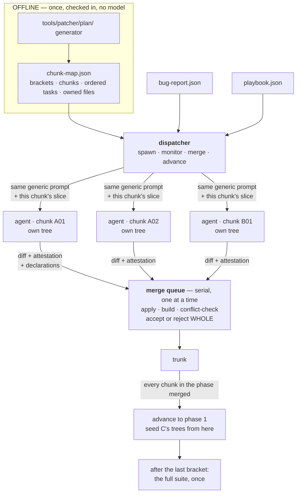
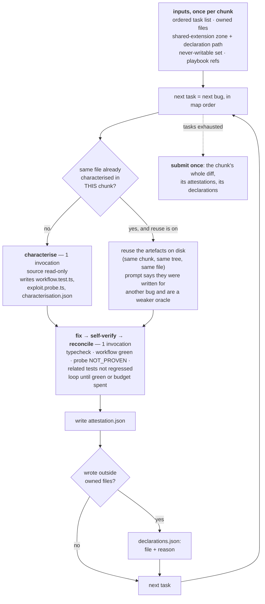

# Patcher v3 — offline planning, and an orchestrator that only dispatches

Companion to `tools/patcher/ARCHITECTURE.md` (the v1 task loop) and
`tools/patcher/docs/PARALLELISATION.md` (the v2 wave planner and executor). Both
of those are shipped, load-bearing and unchanged by this document. v3 lives
beside them.

Blind-safe. No challenge identifier, file, line, reference fix or oracle title
appears here.

**Status: implemented and unit-tested; never yet run against a model.** Every
number below that is labelled *measured* comes from a v1 or v2 run and is quoted
to size a v3 decision. Every number labelled *guess* is a guess. Nothing here has
a v3 measurement behind it, because v3 has not been run.

---

## 1. What actually changes

One sentence: **planning moves offline, and the orchestrator stops being a
judge.**

| | Who plans | When | Who decides a fix is done | What the orchestrator tests |
|---|---|---|---|---|
| **v1** | nobody — one task per bug, in order | — | the orchestrator, per phase | typecheck, workflow test, probe, related tests, per task |
| **v2** | the orchestrator, from the import graph | at run start | the orchestrator, per phase | the same, per task, plus a post-wave gate per unit |
| **v3** | a checked-in artefact, produced offline | before the run exists | **the chunk agent, in its own tree** | **does it apply, does it build, does it conflict** |

Everything else follows from that. The orchestrator no longer needs the
characterisation artefacts, no longer needs a per-task baseline, and no longer
has an opinion about whether a vulnerability is closed — so it does not read one.

Two reasons this is worth doing, in the order they matter:

1. **A planner that runs at runtime is a planner whose output cannot be
   reviewed.** v2's plan is a pure function of its inputs and is tested as one,
   which is most of the way there — but it is still computed inside the process
   that spends the money, from a tree that the run itself is mutating. v2 had to
   grow an explicit rule against recomputing the plan per checkpoint, because
   reading the import graph of an already-patched tree lets a fix that added an
   import silently reshape the remaining waves, and the run would then have
   executed two plans while reporting one. An offline artefact cannot do that.
2. **The orchestrator's gates were the serial bottleneck and the coupling.** v2
   measured its own post-wave gate as a queue that *grew with the width of the
   wave* — 8 units is 17 test runs, the full-set plan's widest wave is 31 units
   and 63 runs — sitting on the merge path with every worker idle. Raising the
   worker count handed part of the gain straight back. v3 removes those runs from
   the barrier entirely rather than pooling them.

---

## 2. The offline plan

A **chunk map** is produced once, offline, by a generator under
`tools/patcher/plan/`, and checked in. No model is involved and nothing
recomputes it during a run.

```
bracket   an ordering unit. Brackets are scheduled into phases.
chunk     an ownership unit. One agent, one tree, one exclusive set of files.
task      one bug. Ordered within its chunk.
```

The four brackets:

| Bracket | Contents | Phase | Why it is separable |
|---|---|---|---|
| **A** core | `lib/**`, `models/**` | 0 | everything imports it, so it must land before its dependants |
| **B** frontend + contracts | frontend sources, API contract files | 0 | no import edge to the server side, so it is independent of A by construction |
| **C** handlers + seed | `routes/**`, `data/**` | 1 | imports A; must be patched against a tree where A's fixes are already in |
| **D** wiring | `server.ts` | 2 | imports essentially everything — it is the app wiring, and should be edited last |

A and B run **concurrently in phase 0**, then C, then D. The dependency rule is
enforced, not documented: `chunk_map.validate()` rejects a `depends_on` edge
between two brackets in the same phase, because brackets in one phase run at the
same time and such an edge is a claim the schedule does not honour.

### 2.1 The schema

```json
{
  "map_id": "chunk-map/v1",
  "bug_count": 97, "chunk_count": 14,
  "excluded_bugs": [{"bug_id": "...", "file": "...", "reason": "..."}],
  "shared_extension_zone": ["views/**", "config/**", "swagger.yml"],
  "never_writable": ["test/**", "**/*.spec.ts"],
  "read_denylist": ["models/challenge.ts", "lib/antiCheat.ts", "data/datacreator.ts"],
  "phases": [{"phase": 0, "brackets": ["A", "B"], "concurrency": 6}],
  "brackets": [{
    "bracket": "A", "name": "core", "phase": 0, "depends_on": [], "concurrency": 4,
    "chunks": [{
      "chunk_id": "A01",
      "reason": "why these files are one chunk",
      "files": ["lib/insecurity.ts"],
      "tasks": [{"bug_id": "BUG-013", "file": "lib/insecurity.ts", "line": 91,
                 "class": "..."}]
    }]
  }]
}
```

`files` lists **only files that carry bugs**. A chunk is not a directory; it is
the set of files one agent owns for the duration.

### 2.2 What the loader refuses, and why each one is silent

`tools/patcher/src/v3/chunk_map.py` validates before anything is spent. Every
check below exists because the failure it prevents does not crash the run — it
changes the number the run reports.

| Rejected | Because |
|---|---|
| a bug in two chunks | two agents fix one defect in two trees. Conflict at best, double fix at worst, and the run's denominator stops matching the report |
| a bug in neither a chunk nor `excluded_bugs` | the denominator quietly shrinks and the run reads as a **better** result than it is |
| a file in two chunks | single ownership is the *only* reason chunks may run concurrently without a merge protocol. A map that breaks it has relabelled the collision, not removed it |
| a task on a file its chunk does not own | every fix it makes is an out-of-boundary write, so the chunk silently merges last and the run serialises |
| a chunk file with no task on it | one chunk per file means the whole file is read into a prompt. A file carrying no bug is pure prompt cost and pure read surface |
| a `read_denylist` file assigned anywhere | this is the v2 per-file lane failure, exactly. That selector never applied the denylist, a file that is 114 of 183 lines of literal challenge keys became a hunt lane, and **two runs' numbers stopped being blind**. The guard existed and was correct; v2 was forked before it moved and never picked it up |
| a `never_writable` file assigned anywhere | the test corpus is how the work is judged |
| `bug_count` that does not equal assigned + excluded | an unaccounted bug is an unaccounted bug |
| a `depends_on` edge inside one phase | see above |
| a bracket in no phase, or in two | it would never run, or it would run twice |
| an exclusion with no reason | an unexplained exclusion silently lowers the denominator |

`validate_against_report()` is separate and pins the map to a specific bug
report: every report bug assigned or excluded, nothing in the map that is not in
the report, and no task whose file disagrees with the report's. A map built for a
different report measures a different denominator. This is the same class of
error as launching a run from a tree that had forked away from the branch the
changes landed on — which happened on 2026-07-28 and produced a baseline that was
later cited as if three changes had been tested and had not worked.

---

## 3. The run



### 3.1 What the orchestrator does and does not do

| Does | Does not |
|---|---|
| spawn one agent per chunk | read an agent's reasoning, transcript or intermediate output |
| hand each one its slice: ordered tasks, owned files, boundary, playbook refs | decide which bug to fix next, or in what order |
| record liveness: did the invocation return, what did it cost | interpret what the invocation produced |
| stop a chunk between tasks on timeout or cost ceiling | interrupt a running agent (it cannot; see §5) |
| own the merge queue, serially | resolve a conflict on the agent's behalf |
| run the **build** gate after each submission | run the typecheck-plus-workflow-plus-probe-plus-regression gate set |
| record contested files and declared out-of-boundary writes | deny an out-of-boundary write |
| advance a phase when every chunk in it has merged | reconcile, rebase, or re-prompt |
| run the full suite **once**, after the last bracket | run any regression net before that |

The single sentence that generates that whole table: **its only test is what
merging requires — does it apply, does it build, does it conflict.**

### 3.2 One agent's per-task loop



Two invocations per task, not one and not v1's two-to-seven:

- **characterise** stays a separate invocation for exactly one reason: it is the
  unit that characterisation reuse skips (§6). Folded into the fix call it could
  not be skipped, and reuse is the only mitigation v3 has for the cost regression
  bug-wise tasks introduce.
- **fix** carries self-verification and reconciliation inside the agent's own
  turn budget. That is the actual v3 change. The orchestrator is not in that
  loop and does not see its rounds.

**Tasks within a chunk are strictly sequential.** Two tasks in one chunk
routinely share a file — that is the normal case, since a chunk is files plus
their bugs — so running them concurrently would reintroduce precisely the
intra-file collision the ownership map exists to remove. Parallelism in v3 exists
only *across chunks*.

---

## 4. The write boundary

Four classes, not two.

| Class | Rule | Reason |
|---|---|---|
| **owned** — the chunk's files | write freely | no other agent can touch them; the map guarantees it |
| **shared extension zone** — `views/**`, `config/**`, `swagger.yml` | write after **declaring** the file and the reason. Declaring puts this chunk **last** in the merge order | several chunks legitimately extend the same view or config. Merging last means the declared write lands on top of the owner's final content, not on a version about to be replaced |
| **outside** — anything else | same: declare it | see below |
| **never writable** — `test/**`, `**/*.spec.ts` | hard deny, not declarable | the test corpus is how the work is judged. A patch that edits a test is not a patch |

**Why "outside" is not simply denied.** *Measured*, Subset 3 pilot: one **correct**
CSRF fix spanned **four files** to plumb a token from a library, through a route,
into a view. Token-based CSRF cannot be done in one file. A hard deny would have
silently restricted the solution space to whatever happens to be locally
patchable — and the run would still have looked successful, which is the worst
available outcome: a measurement that is wrong in the flattering direction.

**An undeclared reach is recorded, not dropped.** Dropping it would produce a
half-applied fix — the plumbing without the check, or the check without the
plumbing. So `boundary.review()` compares declarations against what actually
changed, names the undeclared files, marks the chunk not-clean, and still sends
it to the back of the queue. A chunk cannot dodge the merge-last penalty by
declaring nothing. "How often do fixes need to leave their file" therefore stays
a measurement rather than an assumption.

`read_denylist` is a separate axis and is not about collisions: those files are
answer-key-adjacent, and reads are otherwise unrestricted because a chunk must
read outside itself to fix anything, and a read cannot collide.

---

## 5. The merge queue

Serial. One submission at a time, against one trunk, with the phase's base
snapshot as the three-way merge ancestor.

**Submission granularity, not file granularity.** v2's integrator resolves
contests file by file and drops the losing side of one file while keeping the
rest of that unit. That is right for a wave, where a unit is one file's worth of
work. It is wrong for a chunk: a chunk is an ordered run of many fixes, and
dropping one file out of the middle of it produces exactly the half-applied fix
the boundary rules exist to prevent. So a submission is accepted or rejected
whole.

**Rollback is byte-for-byte from a copy taken immediately before the
submission was applied.** That is what makes *a rejected merge does not poison the
chunks behind it* a property rather than a hope: the next submission starts from
a trunk that has never seen the rejected bytes. A rejected submission also
acquires no file ownership, so a later chunk touching the same file is not told
it is contested and merged against a version nobody shipped.

The queue reuses `integrator._copy_in`, `_merge3` and `_extract_base` by import.
`_merge3` in particular carries a bug fix worth keeping: `git merge-file`
rewrites the file with conflict markers **even when it reports a conflict**, so a
naive caller writes `<<<<<<<` into a `.ts` file, the next phase's build fails, and
the failure is attributed to nobody. A second implementation here would have had
the same bug.

Merge order within a phase: clean chunks first by chunk id, then declaring or
out-of-boundary chunks by chunk id. Deterministic, never a race — this report is
diffed across runs.

### 5.1 Monitoring, and what it honestly cannot do

The orchestrator checks the cost ceiling and the chunk timeout **between tasks**,
not mid-invocation. It cannot reach into a running agent; the per-invocation
timeout belongs to the runner (`agent.ClaudeCliRunner.timeout_s`). Reporting a
mid-flight stop it did not make would be exactly the "infrastructure failure read
later as a reasoning result" the repository's reporting rule forbids. A chunk
that is stopped records `stopped: cost_ceiling | timeout` and submits the work it
had finished.

A chunk whose tree could not even be seeded records `stopped: crash: …`, is not
submitted, and does not vanish from the denominator. Its siblings are unaffected —
the same containment property v2's wave runner has.

---

## 6. The cost regression, stated plainly

**v3 tasks are bug-wise. That undoes the file-wise batching win, and the win was
large.**

*Measured*, going the other way (per-bug → per-file, 24-bug subset):

| | Tasks | Wall clock | Cost |
|---|---:|---:|---:|
| per-bug, sequential | 24 | ~10.4 h | ~$190 |
| per-file, sequential | 8 | ~4–5 h | ~$95 |

Roughly half the cost and half the wall clock, from grouping alone. Bug-wise
tasks give that back: a file with 11 bugs becomes 11 sequential tasks, i.e. 11
characterise phases re-reading the same file.

### 6.1 Characterisation reuse — the mitigation, behind a flag

`reuse_characterisation` (default **on**): within one chunk, a task on a file
that an earlier task **in the same chunk** already characterised reuses the
artefacts already sitting in that chunk's tree instead of paying for a fresh
characterise phase. Same chunk, same tree, same file, artefacts on disk.

All three conditions are load-bearing, and a test pins each:

- **same chunk** — another chunk's artefacts are in another tree entirely, and
  handing them over would put a second chunk's oracle inside this sandbox. Since
  the map forbids a file in two chunks, cross-chunk same-file reuse cannot arise
  at all; the per-chunk map is fresh regardless.
- **same file** — a workflow test written to characterise one file is not the
  record of correct behaviour for another.
- **flag** — it exists so the saving can be *measured* against a run without it,
  rather than assumed. It is a real trade, not free: the reused workflow test and
  probe were authored for a different bug in that file, so they are a weaker
  oracle for this one. The prompt says so explicitly and tells the agent to
  report it in the attestation rather than treat a `NOT_PROVEN` from a probe that
  does not exercise this defect as evidence.

**What reuse does and does not recover — a guess, labelled as one.** If the
characterise phase is roughly a third of a task's spend, reuse on a chunk whose
files each carry several bugs recovers a large part of the regression. It does
**not** recover the rest of what file-wise batching bought: the fix phase still
runs once per bug, the file is still re-read in each fix prompt, and the "fix a
shared root cause once rather than making several edits that fight each other"
instruction that per-file units carry has no place to live. **Nobody has measured
this.** Do not quote a number for it until a v3 run and a v2 run have been scored
with the same scorer on the same denominator.

Bug-wise is nevertheless what v3 specifies, because chunk ownership — not task
granularity — is what makes concurrency safe here, and bug-wise tasks are what
give the chunk agent one defect at a time to reason about. That is a design
choice with a known price, stated next to the number.

---

## 7. What v3 gives up versus v2

Three things, none of them small.

**1. The regression net moved to the end.** v1 ran related existing tests per
task against a task-start baseline; v2 added a post-wave gate that re-ran every
unit's own workflow test and probe against the merged tree. That post-wave gate
is the *only* thing in the run that detects a sibling's change reopening another
unit's fix — v2 calls it `reopened`, and it is a real, fired-in-anger signal.
**v3 has no equivalent until the final suite.** Damage is therefore discovered at
the end, when attributing it to a chunk costs a bisect rather than a lookup. This
is the largest thing v3 trades away and it should be the first candidate for
reinstatement if the final suite comes back red.

**2. Nothing verifies the agent's self-verification.** v1's design principle was
that an agent asked to decide when it has iterated enough will decide that it
has — so iteration was a Python loop with a machine-checked exit condition. v3
moves that loop inside the agent. The attestation is recorded and the final suite
is the backstop, but between the two there is no per-task measured gate, and the
`fixed` / `fixed_workflow_only` distinction that `EVAL-METRICS.md` exists to
protect has no orchestrator-side measurement behind it. **A v3 run's in-sandbox
numbers are self-reports.** They must be labelled as such wherever they appear,
and they are not comparable to v1's or v2's measured dispositions.

**3. Bug-wise granularity.** §6.

What v3 gets in exchange: a plan that can be reviewed before it is executed and
cannot drift under the run; an orchestrator small enough to be read in one
sitting; no gate queue at the barrier that grows with concurrency; and a
declared-extension model that makes out-of-boundary writes a measurement.

---

## 8. Files

| File | Role | Status |
|---|---|---|
| `tools/patcher/plan/` | the offline generator and the checked-in map | **another work stream** |
| `tools/patcher/src/v3/chunk_map.py` | load, validate, resolve write boundaries | **implemented** |
| `tools/patcher/src/v3/boundary.py` | owned / shared-extension / never-writable / read-denylist | **implemented** |
| `tools/patcher/src/v3/dispatcher.py` | spawn, monitor, merge, advance; the generic prompt | **implemented** |
| `tools/patcher/src/v3/merge_queue.py` | serial queue: apply, build, conflict-check, accept or reject | **implemented** |
| `tools/patcher/tests/test_v3_*.py` | 68 tests, `FakeRunner`-driven, no network and no model | **implemented** |
| a `run_patcher.py` entry point for v3 | not written | **deliberately not done** |

v1 and v2 are untouched: `wave_plan.py`, `wave_runner.py`, `task_loop.py`,
`integrator.py`, `verify.py`, `workspace.py` and `run_patcher.py` are byte-identical
to their pre-v3 state, as the repository's change-safety rule requires when a v3
is built alongside. Per the lesson from the v2 denylist incident, v3's
security-relevant imports were diffed against v1's rather than only its
behaviour: the read denylist, the never-writable set and the standing constraint
are all present and all enforced in code, not only in prose.

**No v3 entry point exists yet, and that is deliberate.** Wiring v3 into
`run_patcher.py` would edit a v1/v2 file, and there is no chunk map on disk to
run it against. The modules are importable and tested; the entry point should be
added in the same change series that lands the first real map, so that the first
thing it can do is validate that map against the bug report.
