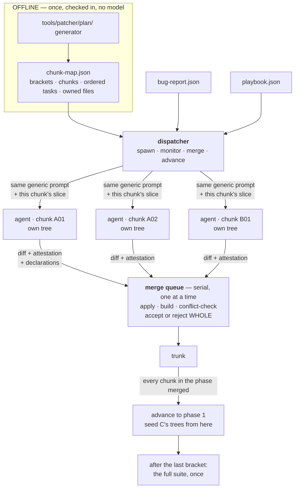
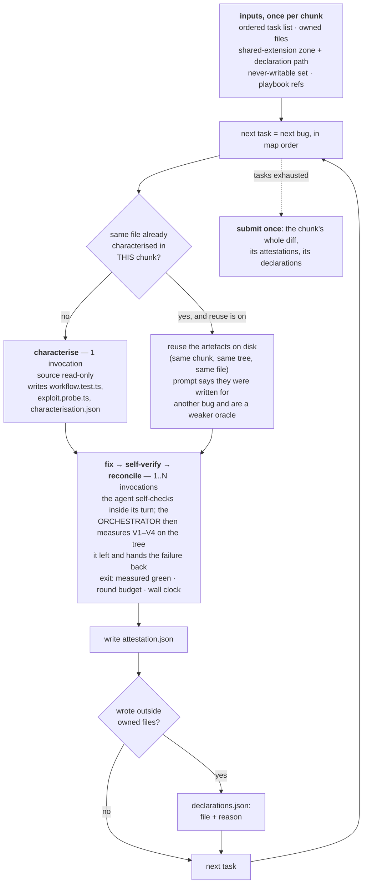

# Patcher v3 — offline planning, and an orchestrator that only dispatches

Companion to `tools/patcher/ARCHITECTURE.md` (the v1 task loop) and
`tools/patcher/docs/PARALLELISATION.md` (the v2 wave planner and executor). Both
of those are shipped, load-bearing and unchanged by this document. v3 lives
beside them.

Blind-safe. No challenge identifier, file, line, reference fix or oracle title
appears here.

**Status: implemented and unit-tested; run against a model three times, all of
them before the fix loop was wired up (§0).** Every number below that is labelled
*measured* comes from a v1 or v2 run and is quoted to size a v3 decision. Every
number labelled *guess* is a guess. Nothing here has a v3 measurement behind it:
the three runs that exist were made under an unenforced fix phase, so their
in-sandbox numbers are self-reports and are not a v3 baseline.

---

## 0. The inner loop is inherited, not redesigned

**v3 changes only the outside of a task.** How work is parallelised, what the
orchestrator does, what the inputs are, and how tasks are divided — bug-wise,
constrained to an owned-file set, grouped into chunks one agent works through in
order. That is the whole of the change.

**The loop inside a task is the one specified in
[`tools/patcher/ARCHITECTURE.md`](../../tools/patcher/ARCHITECTURE.md):** get the
task, write the workflow test that records correct behaviour, write the exploit
probe, fix the vulnerability, run the workflow test to confirm the feature is
preserved, reconcile against the failures, repeat until the work is submitted or
the agent gives up. Same steps, same order, same reasons. That document is the
specification; this one does not restate it and does not override it. Where the
two disagree about the loop, `ARCHITECTURE.md` is right.

**The orchestrator is not a judge — and that has never meant the reconcile loop
is optional.** What "no orchestrator-side gate" was protecting is this: the
runner must not interfere inside a round, must not write code or choose the fix,
and must not run tests *in place of* the agent's own self-verification. The agent
runs its typecheck, its workflow test, its probe and its regression net itself,
inside its turn, and decides what to change. What the orchestrator owns is the
**round boundary**: it invokes the agent, measures V1–V4 against the tree the
agent left, hands the structured failure back, and stops on one of three
machine-checked conditions — measured green, the round budget, the wall clock.

v3's first three runs did not implement that boundary. The loop existed only as
prompt text (*"reconcile and go back to 2, up to N rounds"*) with nothing driving
it: one invocation was spent and `rounds_used` was read out of
`attestation.json`. **That was an under-implementation of this architecture, not
a different one**, and it is why those runs' dispositions are recorded as
*attested*. Since 2026-08 the fix phase runs through `task_loop.run_fix_loop` —
the same function v1 uses — so the budget is spent rather than claimed and the
dispositions are *measured*. §0.3 is written from that.

### 0.1 Phase by phase

| `ARCHITECTURE.md` §3 | v3 | What differs |
|---|---|---|
| **① CHARACTERISE** — one invocation, source read-only, writes `workflow.test.ts`, `exploit.probe.ts`, `characterisation.json` | identical, one invocation, source read-only (sandbox phase `characterise`) | it can be **skipped** when an earlier task in the same chunk already characterised this file (§6.1). Nothing else. |
| **② FIX** — one invocation; source writable, gate artefacts and `test/` frozen | identical (sandbox phase `fix` on round 0, `reconcile` after); same frozen set, same house rules | — |
| **③ VERIFY** — the orchestrator runs V1–V4, agent absent | identical, through `task_loop.run_fix_loop`. The agent also runs the same four commands inside its turn, which is its own self-check and not this gate | the agent is given the commands in its prompt as well, because a round it can pre-check is a round it does not have to spend |
| **④ RECONCILE** — orchestrator re-invokes with the structured failure list, loop while not green and rounds remain | identical. The reconcile prompt is the fix prompt plus the measured failure, so the chunk's write boundary and landed-work block survive into the last round | the budget is `loop.reconcile_rounds` reconciles, i.e. `reconcile_rounds + 1` total rounds, exactly as in v1 |
| **⑤ ATTEST** — the last `attestation.json` is read, not re-requested | identical | — |
| **§4 between tasks** — snapshot, revert on the revert dispositions, harvest scratch, flush | per-task snapshot and revert on `agent_failed` / `blocked`; scratch stays in the chunk tree | a chunk is submitted **whole**, so there is no per-task revert that would not also drop the tasks around it |

### 0.2 Gate by gate

| Gate | v1/v2 | v3 | Basis in v3 |
|---|---|---|---|
| **G1** workflow test passes on the untouched tree | orchestrator runs it, and `blocked` if it is red | orchestrator runs it in the baseline sweep taken just before the fix loop | *measured* — but v3 does not block on it. The task proceeds and the record carries the pre-fix verdict, so a red V2 afterwards is not read as damage this fix did |
| **G2** probe prints `PROVEN` on the untouched tree | orchestrator runs it | the agent runs it and reports; v3 does not re-run the probe pre-fix | *attested* — the one attested input left inside a measured disposition. It decides whether V3 is a live gate or a skipped one, and therefore separates `fixed` from `fixed_workflow_only`, which is why `characterisation.json` is required to carry `probe_result_now` |
| **G3** the three artefacts exist and the JSON parses | orchestrator checks, retries up to `loop.characterise_rounds`, else `blocked` | **identical** — this is a filesystem fact and needs no gate run | *measured* |
| **V1** typecheck · **V2** workflow · **V3** probe `NOT_PROVEN` · **V4** related tests vs baseline | orchestrator, every round, structured failures fed back | **identical** — orchestrator, every round, structured failures fed back. The agent runs the same commands inside its turn as a self-check | *measured*, recorded per round. V3 is `skipped` rather than run when the agent reported the probe never proved the defect |
| **V5** blast radius (advisory) | orchestrator, per task | orchestrator, per task, from a per-task snapshot of the chunk tree | *measured* |
| build (does the trunk still compile) | — | merge queue, once per submission | *measured* |
| whole suite | — | once, after the last bracket | *measured* |

### 0.3 Disposition by disposition

All of `ARCHITECTURE.md` §2 are produced, and **nothing else is permitted**.
Every record carries `disposition_basis`. Since the fix phase is driven by
`run_fix_loop`, the dispositions it reaches are *measured* — the same basis a v1
row has. `attested` in a v3 run now marks the pre-fix residue, and a run with a
large `attested` share is a run whose tasks mostly never reached a fix phase.

The mapping is from the loop's own label, which is read off the gates on the
round whose tree was kept (`task_loop._derive_label`):

| Disposition | Label | How v3 reaches it | Basis |
|---|---|---|---|
| `fixed` | `green` | probe stopped proving the defect, build + workflow + net clean, at least one source file changed | **measured** |
| `fixed_workflow_only` | `workflow_only` | build, workflow and net measured clean, but V3 was **skipped** — the probe never reached `PROVEN` pre-fix, or the oracle was reused from another bug in the file. A skipped remediation gate is not a closed vulnerability | **measured** (over one attested input, G2) |
| `fixed_workflow_red` | `vuln_only` | probe stopped proving the defect, and the workflow test or the regression net was still red when the budget ran out. Reporting only — no revert, and no anti-oracle claim is adjudicated | **measured** |
| `partial` | `neither` | neither axis satisfied after every round, and the work is on disk. Kept because a chunk is submitted whole | **measured** |
| `abandoned` | any | the task changed no source file; **or** its chunk's submission was rejected at the merge queue and rolled back, so no part of it reached the trunk | **measured** |
| `already_remediated` | — | the agent reported the probe would not fire and an earlier task in the same chunk already changed that `file:line`. Closes with **no fix phase**, exactly as §③ G2 says | **attested** |
| `agent_failed` | `agent_failed` | no fix invocation returned successfully, or one returned and wrote no parseable `attestation.json` — its contract's only durable output. Edits reverted, and the reason records the gates being thrown away | **measured** |
| `blocked` | — | no workflow record on disk after the characterise retries; or the chunk stopped (cost ceiling, timeout, crash) before this task was reached | **measured** |

Two orderings in that table are deliberate and easy to get backwards. **An
unchanged tree is `abandoned` whatever the label says** — a green sheet over an
empty diff means a gate is answering about something other than this task.
And **`agent_failed` outranks a green measurement**: a run can measure green and
still have no parseable attestation, and the tree is reverted anyway, because a
change nobody can describe is not submittable. The gates it is discarding go into
`disposition_reason` rather than vanishing.

`fixed`, `fixed_workflow_only` and `fixed_workflow_red` are counted in separate
buckets at task, chunk, phase and run level and are never summed — the same rule
`report.py` encodes, for the same reason. `fixed_workflow_red` in particular is
the one case where the disposition records a fact the orchestrator cannot check:
whether the red assertion encoded the vulnerable behaviour or the fix broke the
feature. Keeping it in its own bucket is what makes the question askable later;
summing it into `fixed` is what made it invisible before.

`workflow_red` entries and `antioracle_claims` name test files, so they are
per-task record material only. The published aggregate row carries the
disposition **count**, under a name that locates nothing.

**Bug-wise tasks make `already_remediated` common rather than exotic.** A chunk
*is* a set of files and their bugs, so a later bug at a location an earlier fix
already changed is the ordinary case. v1 could afford to treat it as a corner.
v3 cannot.

### 0.4 What the eval gets back, and what it still does not

This section used to list four fields a v3 record did not carry. Three of them
came back when the fix loop was wired up, because they were only missing while
the loop was prompt text; one is still absent by choice.

| Field | v3 value | Note |
|---|---|---|
| `measured.rounds[]` | one entry per measured round: gates, per-gate seconds, excused rows, structured failures, and the invocation | the per-round gate table is back. Which gate was red in round 2 is answerable again |
| `measured.rounds_to_green` | the round that went green, or `null` | the rounds-to-green distribution — §8's "main cost lever" — is populated for a v3 run |
| `measured.rounds_used` | rounds this process ran | never `attestation.json → rounds_used`, which is kept separately under `attested` so the two can be compared |
| `measured.final_gates` | the gate verdict of the round whose tree was kept | the **selected** round, not the last one, because that is the tree that will be submitted |
| `measured.label` | `green` / `vuln_only` / `workflow_only` / `neither` / `agent_failed` | the loop's reading of the gates, before the disposition mapping |
| `measured.characterisation.workflow_green_pre_fix` | measured, from the pre-fix baseline sweep | |
| `measured.characterisation.probe_proven_pre_fix` | still `null` | the probe is not re-run against the untouched tree. The attested form is in `attested_characterisation`, and it is what decides whether V3 is live or skipped |

A null here means **"not measured"**, never a zero meaning "measured and clean".
A consumer that reads `probe_proven_pre_fix: null` as falsey under-reports probe
coverage — the safe direction. One that read `rounds_to_green` as `0` would
report a task as going green on the first try, which is why it is null and not
absent. `measured.gates_run` says how many gate suites actually ran; zero there
now means the task never reached its fix phase, not that the architecture has no
gates.

**The cost of having them back.** The gates run once per round per task, so a
task that spends its whole budget pays for `reconcile_rounds + 1` gate suites on
top of its agent time. Wall time per task rises accordingly and
`loop.chunk_timeout_s` should be re-checked before the next run — a chunk timeout
sized for an ungated fix phase will now stop chunks between tasks that would
otherwise have finished.

---

## 1. What actually changes

One sentence: **planning moves offline, and the orchestrator stops judging what a
fix should be.** It still measures whether one worked, at the round boundary —
that part was never given up, only left unimplemented for three runs (§0).

| | Who plans | When | Who decides a fix is done | What the orchestrator tests |
|---|---|---|---|---|
| **v1** | nobody — one task per bug, in order | — | the orchestrator, per phase | typecheck, workflow test, probe, related tests, per task |
| **v2** | the orchestrator, from the import graph | at run start | the orchestrator, per phase | the same, per task, plus a post-wave gate per unit |
| **v3** | a checked-in artefact, produced offline | before the run exists | the loop, per round, in the chunk's own tree | typecheck, workflow test, probe, related tests, per round — plus does it apply, does it build, does it conflict, at the merge queue |

Everything else follows from the planning move. What the orchestrator gave up is
*planning* and *judgement inside a round* — it does not decide what the fix
should be, does not edit, and does not pre-empt the agent's own self-check. What
it never gave up, and what its first three runs failed to implement, is the round
boundary: invoke, measure, hand the failure back, stop on a checked condition.

Two reasons this is worth doing, in the order they matter:

1. **A planner that runs at runtime is a planner whose output cannot be
   reviewed.** v2's plan is a pure function of its inputs and is tested as one,
   which is most of the way there — but it is still computed inside the process
   that spends the money, from a tree that the run itself is mutating. v2 had to
   grow an explicit rule against recomputing the plan per checkpoint, because
   reading the import graph of an already-patched tree lets a fix that added an
   import silently reshape the remaining waves, and the run would then have
   executed two plans while reporting one. An offline artefact cannot do that.
2. **The orchestrator's gates were the serial bottleneck and the coupling.** v2
   measured its own post-wave gate as a queue that *grew with the width of the
   wave* — 8 units is 17 test runs, the full-set plan's widest wave is 31 units
   and 63 runs — sitting on the merge path with every worker idle. Raising the
   worker count handed part of the gain straight back. v3 removes those runs from
   the barrier entirely rather than pooling them.

---

## 2. The offline plan

A **chunk map** is produced once, offline, by a generator under
`tools/patcher/plan/`, and checked in. No model is involved and nothing
recomputes it during a run.

```
bracket   an ordering unit. Brackets are scheduled into phases.
chunk     an ownership unit. One agent, one tree, one exclusive set of files.
task      one bug. Ordered within its chunk.
```

The four brackets:

| Bracket | Contents | Phase | Why it is separable |
|---|---|---|---|
| **A** core | `lib/**`, `models/**` | 0 | everything imports it, so it must land before its dependants |
| **B** frontend + contracts | frontend sources, API contract files | 0 | no import edge to the server side, so it is independent of A by construction |
| **C** handlers + seed | `routes/**`, `data/**` | 1 | imports A; must be patched against a tree where A's fixes are already in |
| **D** wiring | `server.ts` | 2 | imports essentially everything — it is the app wiring, and should be edited last |

A and B run **concurrently in phase 0**, then C, then D. The dependency rule is
enforced, not documented: `chunk_map.validate()` rejects a `depends_on` edge
between two brackets in the same phase, because brackets in one phase run at the
same time and such an edge is a claim the schedule does not honour.

### 2.1 The schema

```json
{
  "map_id": "chunk-map/v1",
  "bug_count": 97, "chunk_count": 14,
  "excluded_bugs": [{"bug_id": "...", "file": "...", "reason": "..."}],
  "shared_extension_zone": ["views/**", "config/**", "swagger.yml"],
  "never_writable": ["test/**", "**/*.spec.ts"],
  "read_denylist": ["models/challenge.ts", "lib/antiCheat.ts", "data/datacreator.ts"],
  "phases": [{"phase": 0, "brackets": ["A", "B"], "concurrency": 6}],
  "brackets": [{
    "bracket": "A", "name": "core", "phase": 0, "depends_on": [], "concurrency": 4,
    "chunks": [{
      "chunk_id": "A01",
      "reason": "why these files are one chunk",
      "files": ["lib/insecurity.ts"],
      "tasks": [{"bug_id": "BUG-013", "file": "lib/insecurity.ts", "line": 91,
                 "class": "..."}]
    }]
  }]
}
```

`files` lists **only files that carry bugs**. A chunk is not a directory; it is
the set of files one agent owns for the duration.

### 2.2 What the loader refuses, and why each one is silent

`tools/patcher/src/v3/chunk_map.py` validates before anything is spent. Every
check below exists because the failure it prevents does not crash the run — it
changes the number the run reports.

| Rejected | Because |
|---|---|
| a bug in two chunks | two agents fix one defect in two trees. Conflict at best, double fix at worst, and the run's denominator stops matching the report |
| a bug in neither a chunk nor `excluded_bugs` | the denominator quietly shrinks and the run reads as a **better** result than it is |
| a file in two chunks | single ownership is the *only* reason chunks may run concurrently without a merge protocol. A map that breaks it has relabelled the collision, not removed it |
| a task on a file its chunk does not own | every fix it makes is an out-of-boundary write, so the chunk silently merges last and the run serialises |
| a chunk file with no task on it | one chunk per file means the whole file is read into a prompt. A file carrying no bug is pure prompt cost and pure read surface |
| a `read_denylist` file assigned anywhere | this is the v2 per-file lane failure, exactly. That selector never applied the denylist, a file that is 114 of 183 lines of literal challenge keys became a hunt lane, and **two runs' numbers stopped being blind**. The guard existed and was correct; v2 was forked before it moved and never picked it up |
| a `never_writable` file assigned anywhere | the test corpus is how the work is judged |
| `bug_count` that does not equal assigned + excluded | an unaccounted bug is an unaccounted bug |
| a `depends_on` edge inside one phase | see above |
| a bracket in no phase, or in two | it would never run, or it would run twice |
| an exclusion with no reason | an unexplained exclusion silently lowers the denominator |

`validate_against_report()` is separate and pins the map to a specific bug
report: every report bug assigned or excluded, nothing in the map that is not in
the report, and no task whose file disagrees with the report's. A map built for a
different report measures a different denominator. This is the same class of
error as launching a run from a tree that had forked away from the branch the
changes landed on — which happened on 2026-07-28 and produced a baseline that was
later cited as if three changes had been tested and had not worked.

---

## 3. The run



### 3.1 What the orchestrator does and does not do

| Does | Does not |
|---|---|
| spawn one agent per chunk | read an agent's reasoning, transcript or intermediate output |
| hand each one its slice: ordered tasks, owned files, boundary, playbook refs | decide which bug to fix next, or in what order |
| record liveness: did the invocation return, what did it cost | read an agent's reasoning, or grade the prose it produced |
| stop a chunk between tasks on timeout or cost ceiling | interrupt a running agent (it cannot; see §5) |
| own the merge queue, serially | resolve a conflict on the agent's behalf |
| run the typecheck-plus-workflow-plus-probe-plus-regression gate set **at each round boundary**, and hand the structured failure back | run any of those four *in place of* the agent's own self-verification inside a round |
| run the **build** gate after each submission | re-judge a submission's patch at the merge queue — the queue asks only what merging asks |
| record contested files and declared out-of-boundary writes | deny an out-of-boundary write |
| advance a phase when every chunk in it has merged | rebase, or re-prompt outside the round budget |
| run the full suite **once**, after the last bracket | run a *cross-chunk* regression net before that (§7) |

Two sentences generate that whole table. **At the merge queue, its only test is
what merging requires — does it apply, does it build, does it conflict.** **At
the round boundary, it measures V1–V4 and hands back what failed** — the
measurement, never an opinion about the change, and never a substitute for the
self-check the agent runs inside its own turn.

### 3.2 One agent's per-task loop



Two to seven invocations per task, the same shape v1 has:

- **characterise** stays a separate invocation for exactly one reason: it is the
  unit that characterisation reuse skips (§6). Folded into the fix call it could
  not be skipped, and reuse is the only mitigation v3 has for the cost regression
  bug-wise tasks introduce.
- **fix** is one invocation per round — `loop.reconcile_rounds + 1` at most. The
  agent self-verifies inside its own turn, and the orchestrator then measures
  V1–V4 on the tree the turn left and hands the structured failure into the next
  round. So the orchestrator *is* in that loop and does see its rounds: it owns
  the boundary between them. What it does not do inside a round is write code,
  choose or narrow the fix, or run a check in the agent's place.

**Tasks within a chunk are strictly sequential.** Two tasks in one chunk
routinely share a file — that is the normal case, since a chunk is files plus
their bugs — so running them concurrently would reintroduce precisely the
intra-file collision the ownership map exists to remove. Parallelism in v3 exists
only *across chunks*.

---

## 4. The write boundary

Four classes, not two.

| Class | Rule | Reason |
|---|---|---|
| **owned** — the chunk's files | write freely | no other agent can touch them; the map guarantees it |
| **shared extension zone** — `views/**`, `config/**`, `swagger.yml` | write after **declaring** the file and the reason. Declaring puts this chunk **last** in the merge order | several chunks legitimately extend the same view or config. Merging last means the declared write lands on top of the owner's final content, not on a version about to be replaced |
| **outside** — anything else | same: declare it | see below |
| **never writable** — `test/**`, `**/*.spec.ts` | hard deny, not declarable | the test corpus is how the work is judged. A patch that edits a test is not a patch |

**Why "outside" is not simply denied.** *Measured*, Subset 3 pilot: one **correct**
CSRF fix spanned **four files** to plumb a token from a library, through a route,
into a view. Token-based CSRF cannot be done in one file. A hard deny would have
silently restricted the solution space to whatever happens to be locally
patchable — and the run would still have looked successful, which is the worst
available outcome: a measurement that is wrong in the flattering direction.

**An undeclared reach is recorded, not dropped.** Dropping it would produce a
half-applied fix — the plumbing without the check, or the check without the
plumbing. So `boundary.review()` compares declarations against what actually
changed, names the undeclared files, marks the chunk not-clean, and still sends
it to the back of the queue. A chunk cannot dodge the merge-last penalty by
declaring nothing. "How often do fixes need to leave their file" therefore stays
a measurement rather than an assumption.

`read_denylist` is a separate axis and is not about collisions: those files are
answer-key-adjacent, and reads are otherwise unrestricted because a chunk must
read outside itself to fix anything, and a read cannot collide.

---

## 5. The merge queue

Serial. One submission at a time, against one trunk, with the phase's base
snapshot as the three-way merge ancestor.

**Submission granularity, not file granularity.** v2's integrator resolves
contests file by file and drops the losing side of one file while keeping the
rest of that unit. That is right for a wave, where a unit is one file's worth of
work. It is wrong for a chunk: a chunk is an ordered run of many fixes, and
dropping one file out of the middle of it produces exactly the half-applied fix
the boundary rules exist to prevent. So a submission is accepted or rejected
whole.

**Rollback is byte-for-byte from a copy taken immediately before the
submission was applied.** That is what makes *a rejected merge does not poison the
chunks behind it* a property rather than a hope: the next submission starts from
a trunk that has never seen the rejected bytes. A rejected submission also
acquires no file ownership, so a later chunk touching the same file is not told
it is contested and merged against a version nobody shipped.

The queue reuses `integrator._copy_in`, `_merge3` and `_extract_base` by import.
`_merge3` in particular carries a bug fix worth keeping: `git merge-file`
rewrites the file with conflict markers **even when it reports a conflict**, so a
naive caller writes `<<<<<<<` into a `.ts` file, the next phase's build fails, and
the failure is attributed to nobody. A second implementation here would have had
the same bug.

Merge order within a phase: clean chunks first by chunk id, then declaring or
out-of-boundary chunks by chunk id. Deterministic, never a race — this report is
diffed across runs.

### 5.1 Monitoring, and what it honestly cannot do

The orchestrator checks the cost ceiling and the chunk timeout **between tasks**,
not mid-invocation. It cannot reach into a running agent; the per-invocation
timeout belongs to the runner (`agent.ClaudeCliRunner.timeout_s`). Reporting a
mid-flight stop it did not make would be exactly the "infrastructure failure read
later as a reasoning result" the repository's reporting rule forbids. A chunk
that is stopped records `stopped: cost_ceiling | timeout` and submits the work it
had finished.

A chunk whose tree could not even be seeded records `stopped: crash: …`, is not
submitted, and does not vanish from the denominator. Its siblings are unaffected —
the same containment property v2's wave runner has.

---

## 6. The cost regression, stated plainly

**v3 tasks are bug-wise. That undoes the file-wise batching win, and the win was
large.**

*Measured*, going the other way (per-bug → per-file, 24-bug subset):

| | Tasks | Wall clock | Cost |
|---|---:|---:|---:|
| per-bug, sequential | 24 | ~10.4 h | ~$190 |
| per-file, sequential | 8 | ~4–5 h | ~$95 |

Roughly half the cost and half the wall clock, from grouping alone. Bug-wise
tasks give that back: a file with 11 bugs becomes 11 sequential tasks, i.e. 11
characterise phases re-reading the same file.

### 6.1 Characterisation reuse — the mitigation, behind a flag

`reuse_characterisation` (default **on**): within one chunk, a task on a file
that an earlier task **in the same chunk** already characterised reuses the
artefacts already sitting in that chunk's tree instead of paying for a fresh
characterise phase. Same chunk, same tree, same file, artefacts on disk.

All three conditions are load-bearing, and a test pins each:

- **same chunk** — another chunk's artefacts are in another tree entirely, and
  handing them over would put a second chunk's oracle inside this sandbox. Since
  the map forbids a file in two chunks, cross-chunk same-file reuse cannot arise
  at all; the per-chunk map is fresh regardless.
- **same file** — a workflow test written to characterise one file is not the
  record of correct behaviour for another.
- **flag** — it exists so the saving can be *measured* against a run without it,
  rather than assumed. It is a real trade, not free: the reused workflow test and
  probe were authored for a different bug in that file, so they are a weaker
  oracle for this one. The prompt says so explicitly and tells the agent to
  report it in the attestation rather than treat a `NOT_PROVEN` from a probe that
  does not exercise this defect as evidence.

**What reuse does and does not recover — a guess, labelled as one.** If the
characterise phase is roughly a third of a task's spend, reuse on a chunk whose
files each carry several bugs recovers a large part of the regression. It does
**not** recover the rest of what file-wise batching bought: the fix phase still
runs once per bug, the file is still re-read in each fix prompt, and the "fix a
shared root cause once rather than making several edits that fight each other"
instruction that per-file units carry has no place to live. **Nobody has measured
this.** Do not quote a number for it until a v3 run and a v2 run have been scored
with the same scorer on the same denominator.

Bug-wise is nevertheless what v3 specifies, because chunk ownership — not task
granularity — is what makes concurrency safe here, and bug-wise tasks are what
give the chunk agent one defect at a time to reason about. That is a design
choice with a known price, stated next to the number.

---

## 7. What v3 gives up versus v2

Three things, none of them small — and the second of them has since come back.

**1. The cross-chunk re-measurement moved to the end.** The *per-task* net is
not what moved: v1 runs related existing tests per task against a task-start
baseline, and so does v3, as V4 at every round boundary. What v2 added on top was
a post-wave gate that re-ran every unit's own workflow test and probe against the
**merged** tree. That post-wave gate is the *only* thing in the run that detects a
sibling's change reopening another unit's fix — v2 calls it `reopened`, and it is
a real, fired-in-anger signal.
**v3 has no equivalent until the final suite.** Damage is therefore discovered at
the end, when attributing it to a chunk costs a bisect rather than a lookup. This
is the largest thing v3 trades away and it should be the first candidate for
reinstatement if the final suite comes back red.

**2. ~~Nothing verifies the agent's self-verification.~~ FIXED 2026-08 — kept
here because the first three v3 runs were scored under it.** v1's design
principle is that an agent asked to decide when it has iterated enough will
decide that it has, so iteration is a Python loop with a machine-checked exit
condition. v3's architecture never abandoned that principle; its first three runs
simply did not implement it — the loop was prompt text, `rounds_used` was the
agent's own number, and between the attestation and the final suite there was no
per-task measured gate. **Those runs' in-sandbox numbers are self-reports**,
labelled `disposition_basis: attested` in the record itself rather than in a
footnote, and they are not comparable with v1's or v2's measured dispositions —
or with a v3 run from 2026-08 onward.

The fix phase now runs through `task_loop.run_fix_loop` (§0), so `rounds[]`,
`final_gates`, `rounds_to_green` and a measured disposition are all back. What is
still attested is the pre-fix probe verdict, which is what separates `fixed` from
`fixed_workflow_only` — a weaker claim than v1's measured form, and not the same
thing as losing the distinction. Collapsing the two into a single `fixed` count
would be the false-confidence failure `EVAL-METRICS.md` exists to catch.

**Do not read across that line.** A v3 run before 2026-08 and one after it are
not the same measurement, for the same reason two oracle sets are not one trend:
the numbers changed because what produced them changed, not because the patcher
did.

**3. Bug-wise granularity.** §6.

What v3 gets in exchange: a plan that can be reviewed before it is executed and
cannot drift under the run; an orchestrator small enough to be read in one
sitting; no gate queue at the barrier that grows with concurrency; and a
declared-extension model that makes out-of-boundary writes a measurement.

---

## 8. Files

**v3 is not `src/v3/`.** Its execution path runs through eleven shared modules,
and the column that matters is not what a module *imports* but what v3 actually
*invokes* from it. Import-reachability is exactly what hid the `task_loop` gap
for three runs: `dispatcher.py` imported `task_loop` the whole time and called
nothing in it that ran a loop.

Three statuses, and they mean different things:

- **implemented** — in the tree and exercised by a test that drives it
- **wired here** — the call site landed in this change; before it, the module was
  imported or present but this path did not run
- **not wired** — present in the repository, reachable, and deliberately or
  provisionally not called by v3

### 8.1 v3-specific

| File | Role | Status |
|---|---|---|
| `tools/patcher/plan/` | the offline generator and the checked-in map | **another work stream** |
| `tools/patcher/src/v3/chunk_map.py` | load, validate, resolve write boundaries | **implemented** |
| `tools/patcher/src/v3/boundary.py` | owned / shared-extension / never-writable / read-denylist | **implemented**, with one limit stated below |
| `tools/patcher/src/v3/dispatcher.py` | spawn, monitor, merge, advance; the generic prompt; the round boundary; the per-bug task record and its disposition | **implemented** |
| `tools/patcher/src/v3/merge_queue.py` | serial queue: apply, build, conflict-check, accept or reject. Runs the **build gate only** (`typecheck_gate`) — that is still true and must stay true | **implemented** |
| `tools/patcher/src/v3/run_store.py` | durable per-chunk run store: records survive losing the session | **implemented** |
| `tools/patcher/src/run_patcher_v3.py` | **the v3 entry point** — load, validate, dispatch, checkpoint, audit, report | **implemented** — see below |
| a v3 mode inside `run_patcher.py` | not written, and still deliberately not | **not done** |

**`boundary.may_write` is never called outside tests.** The write boundary is
therefore **post-hoc review**, not enforcement: `boundary.review()` compares what
changed against what was declared, after the chunk is done, and the outcome is a
record and a merge-order penalty rather than a refused write. What *is* enforced
at write time is the never-writable set and the read denylist, by
`hooks/sandbox_guard.py`. An agent that writes outside its owned files without
declaring is caught, named and merged last — it is not stopped.

### 8.2 Shared, and exercised by v3

| File | What v3 invokes | Status |
|---|---|---|
| `src/task_loop.py` | `run_fix_loop` — the enforced reconcile loop the orchestrator drives. v1's `run_task`, `_characterise` and `_finish` stay v1-only, correctly: they own v1's per-task revert policy and its own record shape | **wired here** (`19cb3db`) |
| `src/verify.py` | `verify()` once per round via the loop; `collect_outcomes` for the pre-fix baseline sweep; `typecheck` as the merge queue's build gate; `run_full_suite` once at the end | **implemented** |
| `src/antioracle.py` | `detect` over the task's regression net, handed to the fix loop. Before this, v3 passed `antioracles=None`, which disabled the only excusal path `verify` has — a test that requires the attack to succeed was charged to the fix as damage | **wired here** |
| `src/workspace.py` | `prepare`, `snapshot`, `restore`, `discard_snapshot`, `changed_files`, `changed_files_against`, `base_hashes`, `diff_against_snapshot`, `diff_stats`, `tree_digest`, `ensure_scratch`, `scratch_rel` | **implemented** |
| `src/prompts.py` | `STANDING_CONSTRAINT`, `HOUSE_RULES`, `_fmt_bug`, `_fmt_playbook`, `_fmt_failures`, `RECONCILE_GUIDANCE`. v1's `build_fix` / `build_reconcile` are deliberately **not** used — v3 renders its own so the chunk header, the write boundary and the landed-work block survive into every reconcile round | **implemented** |
| `src/agent.py` | `build_runner`, `runner.run`, `runner.describe`, and the sandbox **hook** the runner launches per phase | **implemented** |
| `src/testmap.py` | `select` — the regression net, agent-named files unioned with a static scan — and `env_for` | **implemented** |
| `src/blind_guard.py` | `select_entry` for the playbook, `audit_run` after the run, and the load / scrub / validate path through preflight | **implemented** |
| `src/report.py` | `aggregate`, `render_summary` | **implemented** |
| `src/integrator.py` | three private merge helpers only: `_copy_in`, `_extract_base`, `_merge3`. `_merge3` carries a fix worth not reimplementing — `git merge-file` rewrites the file with conflict markers even when it reports a conflict | **implemented** |
| `src/run_patcher.py` | `load_config`, `preflight`, `config_digest`. Not config loading only: v3 inherits the whole input, tree and toolchain preflight, including the built-artefacts check that once cost a full run | **implemented** |

`src/workspace.py`'s `harvest_scratch`, `cleanup` and `diff_against_base` are
**not** called by v3. The first is the consequential one: oracle artefacts stay
in the chunk tree and die with it, so the workflow tests and probes cannot be
cited later as evidence of how well a task characterised. §9.5 states that as a
trade rather than a bug.

### 8.3 Present, not wired

| File | Why it is not wired |
|---|---|
| `integrator.post_wave_gate` / `place_scratch` | the **only** detector for a sibling's change reopening another task's fix — §7's first item, and the thing v3 most wants back. Queued rather than dropped in, because `_unit_gate` looks for each task's scratch artefacts *inside the merged tree* and v3's trunk has none. Dropped in as-is it would report MISSING for every task and stay green: a gate that ran nothing and reported a pass, which is worse than no gate |
| `grouping.py`, `state.py`, `wave_plan.py`, `wave_runner.py` | v1/v2 only, and correctly so. `grouping` and `wave_plan` answer the planning question v3 answers offline; `state` is v1/v2's per-task checkpoint, replaced by `run_store`; `wave_runner` is v2's executor |

### 8.4 Tests

| File | Tests | Covers |
|---|---:|---|
| `tests/test_v3_dispatcher.py` | 51 | assignments, prompts, the write boundary, phases, merge verdicts, the denominator |
| `tests/test_v3_measured_fix.py` | 32 | the measured fix phase: rounds, labels, dispositions, the basis field |
| `tests/test_v3_chunk_map.py` | 22 | every refusal in §2.2 |
| `tests/test_workflow_red_disposition.py` | 22 | `fixed_workflow_red` and the attestation's two claim lists |
| `tests/test_v3_run_store.py` | 20 | checkpoint, resume, tree-digest refusal, guard-log merge |
| `tests/test_fix_loop.py` | 19 | `run_fix_loop`'s three exit conditions, its labels, and v1's exhaustion policies still firing through the shared loop |
| `tests/test_v3_boundary.py` | 11 | owned / shared-extension / never-writable / read-denied |
| `tests/test_v3_merge_queue.py` | 11 | three-way merge, build gate, byte-for-byte rollback |
| `tests/test_v3_runtime_artefacts.py` | 9 | the sandbox hook's phase vocabulary, run as a subprocess |
| `tests/test_v3_report_wiring.py` | 8 | the report the entry point writes, against what the run actually did |
| **total** | **205** | all `FakeRunner`-driven — no network, no model, no cost |

Counts measured 2026-08-11; they move as tests land. `python3 -m pytest
tools/patcher/tests -q` is the number that counts.

### 8.5 What building v3 was allowed to change

v1 and v2 are untouched: `wave_plan.py`, `wave_runner.py`, `integrator.py`,
`verify.py`, `workspace.py` and `run_patcher.py` are byte-identical to their
pre-v3 state, as the repository's change-safety rule requires when a v3 is built
alongside.

`task_loop.py` is the one exception, and it is a **pure extraction**: the
fix/verify/reconcile loop moved out of `run_task` into `run_fix_loop` so both
tracks share one exit condition. v1's behaviour is preserved exactly — same
records, same dispositions, same per-round log filenames — verified by driving
`run_task` over ten scenarios and diffing full task records, patches, trees and
snapshot directories before and after.

Per the lesson from the v2 denylist incident, v3's security-relevant imports were
diffed against v1's rather than only its behaviour: the read denylist, the
never-writable set and the standing constraint are all present and all enforced
in code, not only in prose.

**The v3 entry point is `src/run_patcher_v3.py`, a separate script.** It landed
alongside the first real map, exactly as planned: `--check` validates that map
against the bug report before anything is dispatched. It reuses
`run_patcher.load_config`, `preflight` and `config_digest` rather than
duplicating them, so the two tracks cannot drift on how a config is read.

Wiring v3 into `run_patcher.py` instead is still not done, and still
deliberately — it would mean editing the file that runs v1 and v2. One
consequence of that choice is unguarded today: `run_patcher.py` never reads
`chunk_map` and defaults `loop.execution` to `sequential`, so a v3 config passed
to it runs as a v1 run with the plan ignored rather than being refused. See
`tools/patcher/STRUCTURE.md` §9.

---

## 9. Drift found on review, 2026-08-10

The move to v3 was supposed to change only a task's surroundings. Five things
had changed inside it. Four are fixed in `dispatcher.py`; one is a stated trade;
two follow-ups are handed off because they need files this change is not allowed
to touch.

### 9.1 The sandbox hook was not wired into v3 at all — **fixed**

`ClaudeCliRunner` passes the phase name straight through to
`hooks/sandbox_guard.py --phase`, which declares it with
`choices=[characterise, fix, reconcile, other]`. v3 sent `v3-characterise` and
`v3-patch`. argparse rejected both: exit code 2, no decision written, on a
`PreToolUse` hook. Every tool call in a real v3 run would have taken the
no-answer path of a guard that never ran.

Worse than the crash is what it was hiding. Even had the strings parsed, the
hook's two phase-dependent rules key off the exact names:

- `phase == 'characterise'` is what makes the source tree read-only, so the
  baseline is captured from code the agent has not already edited;
- `phase in ('fix', 'reconcile')` is what freezes `workflow.test.ts` and
  `exploit.probe.ts`, so an agent that cannot pass its own gate cannot edit the
  gate instead.

Neither would have applied. The frozen-oracle property that makes the whole loop
mean anything was absent from v3, in prose only. §8 above claimed the
security-relevant imports had been diffed against v1's; the *phase vocabulary*
had not been, and that is the same shape as the v2 denylist incident recorded in
the root `CLAUDE.md` — a guard that existed, was correct, and was never picked up
by the fork.

**Fixed:** `CHARACTERISE_PHASE = 'characterise'`, `PATCH_PHASE = 'fix'`. The
v3-specific naming stays where it belongs, in the log filenames. Two tests pin
it: one runs the real hook as a subprocess with each name and requires exit 0
with a decision, one asserts the two rules actually fire.

This also restores the seed read-denylist at runtime. `chunk_map` refuses to
*assign* a denylisted file; the hook is what refuses to *read* one, in every
phase — and it was not running.

### 9.2 v3 produced no dispositions at all — **fixed**

The task record was `{bug_id, file, task_id, characterised, reused_from,
invocations, cost_usd, related_test_files, attestation}`. No disposition, no
diff stats, no violations. Every disposition-derived number in
`ARCHITECTURE.md` §5.1 and everything `report.py` aggregates was unavailable,
and `fixed` versus `fixed_workflow_only` did not exist to be summed or not
summed.

**Fixed.** §0.3 is the derivation, §0.4 is what genuinely could not be
recovered. Three parts are worth naming separately:

- **`fixed` is never inferred from an attestation alone.** It requires the
  agent's own probe to have demonstrated the defect before the change — which is
  what makes V3 a live gate — *and*, since the loop was wired up, that gate to
  have measured `NOT_PROVEN` afterwards. Everything else green is
  `fixed_workflow_only`.
- **A reused oracle can never produce a bare `fixed`.** The reuse note (§6.1)
  told the agent the artefacts were written for another bug; nothing acted on
  that. Now the record does: reuse degrades the axis-A claim, which gives the
  `reuse_characterisation` flag a cost that shows up in the numbers rather than
  only in a prompt.
- **`characterisation.json`'s keys are now named in the prompt.** v3's
  characterise prompt asked for "which existing test files cover this path" in
  prose while the dispatcher read `char['related_test_files']`. The agent had no
  way to know the key. The net is now both the agent's own pre-check and V4 at
  every round boundary, so a mis-named key silently empties both.
  The prompt now specifies the same object v1's contract does, including
  `probe_result_now`, without which §0.3 has nothing to work from.

### 9.3 Bugs vanished from the denominator — **fixed**

A chunk that stopped on its cost ceiling or timeout simply stopped appending
task records, and a chunk that crashed while seeding contributed none at all.
Those bugs disappeared from `tasks[]` entirely — so a run that ran out of money
reported a *higher* fixed-rate over a *smaller* denominator, with nothing in the
output saying so.

This is the failure §2.2 refuses a chunk map for ("the denominator quietly
shrinks and the run reads as a **better** result than it is"), reappearing at
runtime after the map had been validated.

**Fixed:** every unreached bug gets a record with `disposition: blocked`,
`attempted: false` and a reason naming the stop. `tasks_total` equals the map's
task count whatever happens.

### 9.4 A rejected merge still counted as fixed work — **fixed**

The merge queue rolls a rejected submission back byte for byte, so none of its
tasks reached the trunk — but their records still said `fixed`. The run's
headline count would have included work nobody shipped.

**Fixed:** every task in a rejected submission becomes `abandoned` with
`disposition_basis: measured`, keeping its pre-merge outcome in
`disposition_before_merge` so an integration failure does not erase what the
agent actually achieved. `merge_verdict` is recorded on every task either way.

### 9.5 Two per-task duties of §4 were missing — **one fixed, one a stated trade**

- **Source edits during characterisation** were neither reverted nor recorded.
  v1 hashes the tree around phase ① and reverts anything that got past the hook,
  because a baseline captured from already-edited code is not a baseline.
  **Fixed**, with the `source_edited_in_characterise` violation recorded exactly
  as v1 records it. This is belt-and-braces on top of 9.1, and deliberately so:
  9.1 is why it mattered that this was missing.
- **Scratch is not harvested.** v1 copies each task's artefacts out of the tree
  and deletes them. v3 leaves them in the chunk tree. **This is a trade, not a
  bug, and its cost is that the artefacts die with the tree.** Nothing leaks
  into the deliverable — `iter_source_files` skips the scratch directory, so the
  submission's changed-file set cannot contain it and the merge queue never sees
  it — but the workflow tests and probes, which are evidence about how well the
  agent characterised, are not preserved anywhere a report can cite. Harvesting
  needs a destination convention under `run_dir`, which belongs with the entry
  point.

### 9.6 Handed off, because this change may not touch those files

- **`contracts/task-record.schema.json` sets `additionalProperties: false`** and
  knows none of `disposition_basis`, `attested_characterisation`,
  `merge_verdict`, `disposition_before_merge`, `attempted`, `gates_run`,
  `gates_not_run_reason`, `chunk_id`. A v3 record is a valid v1 record plus
  those fields, so it fails the contract as written. Nothing validates against
  the schema today, which is precisely why this must be landed deliberately
  rather than discovered later: the contract has to learn the *basis* field, or
  the whole point of emitting it is lost the first time someone validates.
- **`report.py` would under-report a v3 run.** `aggregate()` reads
  `measured.characterisation.probe_proven_pre_fix`, which is `null` in v3 and
  falsey, so `probe_coverage` reads 0. That is the safe direction and no number
  comes out flattering, but the v3 entry point needs either its own reporter or
  a `report.py` that distinguishes `null` (not measured) from `false` (measured
  red) and reads `attested_characterisation` when the basis is attested.

### 9.7 Not changed, and deliberately

The settled design was not re-opened: bug-wise tasks, the owned-file boundary,
the checked-in chunk map and one agent per chunk all stand. Everything in §9
restores a *record* the loop already produced, or wires up a guard that already
existed. None of it lets the orchestrator judge inside a round — the per-round
gate set §0 describes is the boundary measurement this architecture always
specified, not a new orchestrator-side judgement bolted on here.
