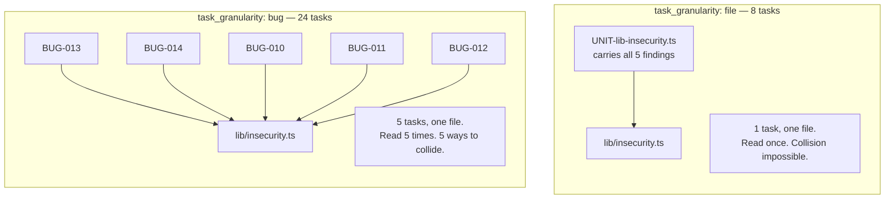
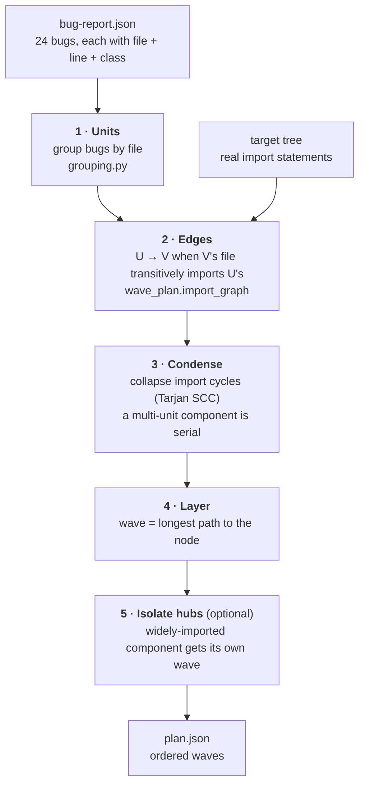
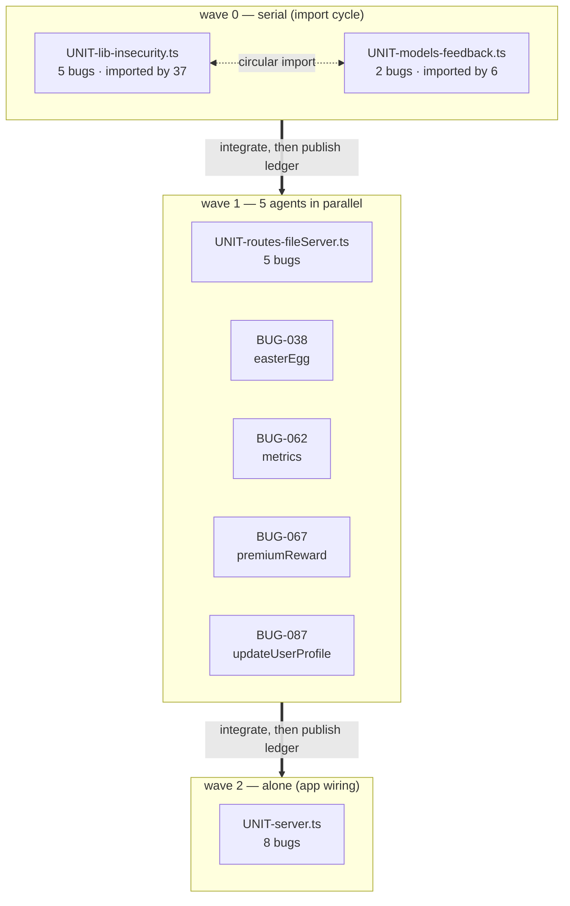
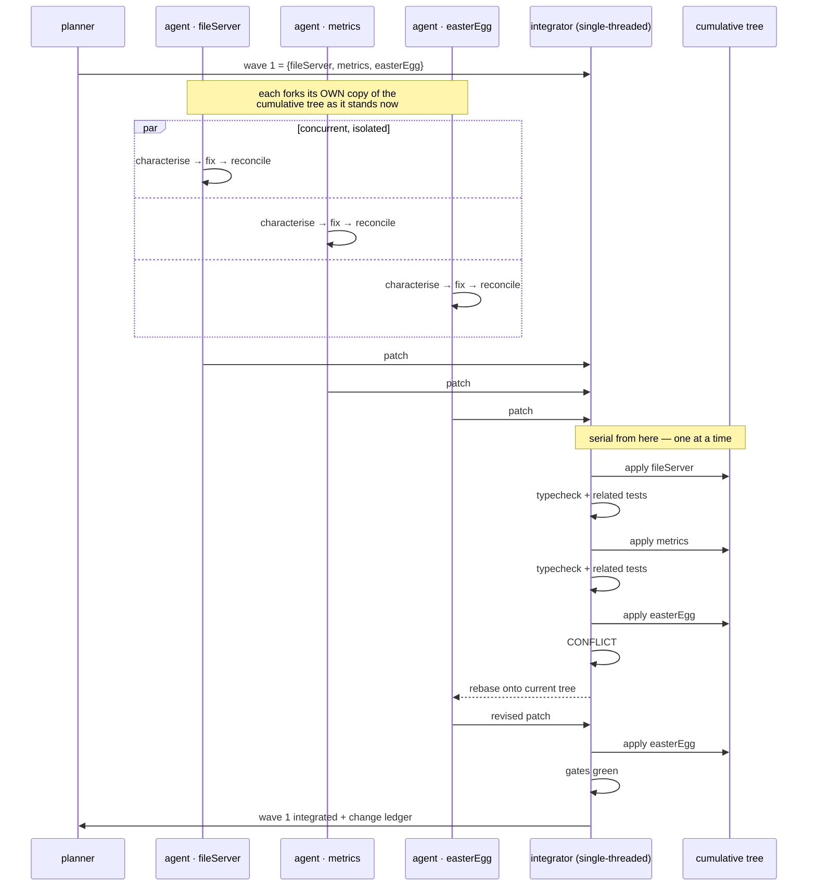

# Parallelising the patcher: per-file units and wave serialisation

## Why

Measured on the two-case Subset 3 pilot: **26 min and $8 per task**, one task at
a time. Extrapolated to the 24-bug Subset 2 report that is **~10.4 h and ~$190**,
and it grows linearly with the dataset. Sequential-with-one-agent does not scale.

The naive fix does not work, and we have the receipts. In bake-off 01 three
parallel units all edited `lib/insecurity.ts`; the merge left conflict markers
and the tree did not compile. `BUILD_FAILED` for all three.

So the problem is not "run more agents". It is **run more agents such that no two
can interfere, and the result is still one coherent codebase.**

## The shape of the answer

Two independent changes. The first is worth doing on its own and de-risks the
second.

| | Tasks | Wall clock | Cost | Status |
|---|---|---|---:|---|
| Per-bug, sequential | 24 | ~10.4 h | ~$190 | shipped (default) |
| **Per-file, sequential** | **8** | **~4–5 h** | **~$95** | **shipped** |
| **Per-file, 3 waves, parallel** | **8** | **~2 h** | ~$95–110 | **shipped** |

---

# Part 1 — Per-file units

`loop.task_granularity: "bug" | "file"`.

One task per *bug* means the same file is characterised once per bug in it. On
Subset 2 that is `server.ts` read and understood 8 separate times,
`lib/insecurity.ts` 5 times, `routes/fileServer.ts` 5 times. It also means eight
tasks can each edit `server.ts`, which is the collision problem in miniature —
before any parallelism is involved.

Grouping by file collapses 24 tasks to 8 **and removes intra-file collisions
entirely**: one agent owns a file for the whole of its task, so two agents
editing one file is not mitigated, it is impossible.



Two details that had to be right:

**The prompt renders every finding, not a summary.** The agent is asked to fix
all of them, is told they share a file, and is told to fix a shared root cause
once rather than making several edits that fight each other.

**Playbook selection merges.** A per-file unit usually spans several classes and
one entry cannot cover it. Taking the first member's entry would supply guidance
for one finding and silence for the rest — worse than a thin section, because it
looks complete. Entries are deduplicated by `entry_id`, and their quoted
documents by source URL: three of the classes on `server.ts` all cite
A05:2021, and without that dedup the merged prompt carried the same cheat sheet
three times — 24 KB of a 59 KB prompt.

A file holding exactly one bug stays the bug itself, not a one-member unit, so
the two modes stay directly comparable on those files: same id, same scratch
directory, same task record.

---

# Part 2 — Deterministic division of the input

**No model is involved in planning.** Everything scheduling needs is already in
the bug report (a file per bug) or readable from the tree (the import graph). A
planner that needed judgement would introduce nondeterminism into a problem with
an exact answer, and would have to be re-run to be trusted.



### Step 1 · Units

`grouping.group(bugs, 'file')`. Files are disjoint, so the partition is a true
partition — every bug in exactly one unit, no bug in two. The tests assert
exactly that, because a unit list that silently dropped a finding would lower the
denominator and read as a *better* score.

### Step 2 · Edges from real imports

For each unit file, resolve its `import`/`require` specifiers against the tree.

- Relative specifiers resolve to a file; `@juice-shop/` is an intra-app alias and
  is followed, so the dependency is not dropped as if it were third-party.
- A specifier that resolves outside the app (`express`, `lodash`) is **not** an
  edge — those files are not being patched.
- The relation is **transitive**. If A imports `mid` and `mid` imports B, then A
  should still see B's change; a direct-only rule would schedule A and B in the
  same wave.

Edge direction: `U → V` means *V depends on U*, so **U lands first**.

### Step 3 · Condense cycles

Circular imports are legal in TypeScript and this target has them —
`lib/insecurity.ts` and `models/feedback.ts` are mutually reachable. The graph is
therefore **not guaranteed acyclic** and cannot be layered directly.

Strongly-connected components are collapsed to a single node (Tarjan, iterated in
sorted order so the output is stable). A component holding more than one unit is
marked `serial_within_wave`: a cycle means "these mutually depend", so they share
a wave and run one after another inside it.

> An earlier version of the hub-isolation pass operated on individual units and
> split this very cycle across two waves. The plan then *read* as two clean solo
> waves while asserting that one member could land before the other — precisely
> what the cycle denies. Isolation now moves whole components, and a test pins it.

### Step 4 · Layer

`wave = longest path to this node` in the condensed DAG. This guarantees the
property the executor relies on: **every unit in a wave is independent of every
other unit in that wave, and depends only on waves already integrated.**

### Step 5 · Isolate hubs (`--isolate-hubs`, default on)

Step 1 makes same-file collisions impossible. What remains is two units reaching
for the same *shared* file — because out-of-scope writes cannot simply be
forbidden (see "Soft scope" below).

`hub_threshold` (default 8) is measured against how many files import the unit's
file. `lib/insecurity.ts` scores **37**. It gets a wave to itself. This costs
wall clock and buys the one collision the file partition cannot prevent; the flag
exists so that trade can be measured rather than assumed.

## The actual Subset 2 plan

```
$ python3 tools/patcher/src/wave_plan.py \
    --bug-report tools/patcher/inputs/bug-report.json \
    --tree target-apps/juice-shop-blind

units 8  bugs 24  waves 3  max parallel 5  isolate_hubs=True (threshold 8)
  hubs given their own wave: UNIT-lib-insecurity.ts, UNIT-models-feedback.ts

  wave 0  (2 unit(s), serial)
     UNIT-lib-insecurity.ts       5 bug(s)  imported_by= 37   CYCLE with UNIT-models-feedback.ts
     UNIT-models-feedback.ts      2 bug(s)  imported_by=  6   CYCLE with UNIT-lib-insecurity.ts

  wave 1  (5 unit(s), parallel)
     UNIT-routes-fileServer.ts    5 bug(s)  after insecurity, feedback
     BUG-038  routes/easterEgg.ts
     BUG-062  routes/metrics.ts
     BUG-067  routes/premiumReward.ts
     BUG-087  routes/updateUserProfile.ts

  wave 2  (1 unit(s), alone)
     UNIT-server.ts               8 bug(s)  after all seven
```



`server.ts` lands last because it imports essentially everything — it is the app
wiring, so it should be edited against a tree where every other fix is already
in place.

---

# Part 3 — Wave serialisation

"Wave serialisation" means: **agents run concurrently inside a wave; integration
into the shared tree is strictly serial; waves are separated by a barrier.**

The ratio is what makes this worth doing. Agent work is ~26 min per unit. The
full test suite is **64 s**. So parallelise the expensive part and serialise the
cheap part, and you keep both properties that make the current results
trustworthy: one cumulative codebase, and every gate run against the real merged
state.



### The barrier and the change ledger

Between waves the integrator writes a factual digest of what landed — file,
exported symbols added or changed, contract notes — and that digest is injected
into the next wave's prompts.

This is the "awareness" the design needs, and it costs nothing: no extra agent,
no coordination protocol, no negotiation. A wave-1 agent editing something that
imports `lib/insecurity.ts` is simply *told* what `insecurity.ts` now exports,
before it reads the file.

### Soft scope, with declared extension

The tempting rule is "you may only write your own file", enforced by the sandbox
hook — which already denies by path, so it is a few lines.

**It would be wrong.** Measured: one correct CSRF fix in the Subset 3 pilot
spanned **four files** to plumb a token from `lib/insecurity.ts` through
`routes/userProfile.ts` into `views/userProfile.pug`. Token-based CSRF cannot be
done in one file. A hard deny would have silently restricted the solution space
to whatever happens to be locally patchable, and the run would have looked
successful.

So scope is soft:

- write inside your unit's file freely;
- write outside it only after **declaring** the file and the reason;
- the integrator reads declarations and serialises those units last, after the
  units that own the declared files.

A declaration is recorded either way, so "how often do fixes need to leave their
file" becomes a measurement instead of an assumption.

### Failure handling

| Failure | Response |
|---|---|
| Patch conflicts on apply | hand back to the owning agent to rebase onto the current tree; bounded rounds |
| Rebase rounds exhausted | revert that unit, record `abandoned`; the wave continues |
| Gates red after apply | revert that unit only — the tree stays green for everyone behind it |
| Agent crashes | its unit is `blocked`; siblings are unaffected |
| Cycle members | run serially inside their wave, never concurrently |

Reverting one unit rather than failing the wave is the point of serial
integration: damage is attributable to the patch that caused it, and one bad
patch cannot poison the units after it.

---

# Files involved

| File | Role | Status |
|---|---|---|
| `tools/patcher/src/grouping.py` | bugs → units; per-file grouping | **shipped** |
| `tools/patcher/src/wave_plan.py` | import graph, SCC condensation, layering, hub isolation | **shipped** |
| `tools/patcher/src/prompts.py` | renders every finding in a multi-bug unit | **shipped** |
| `tools/patcher/src/blind_guard.py` | merges playbook entries for a multi-class unit, dedups documents | **shipped** |
| `tools/patcher/src/run_patcher.py` | `loop.task_granularity`; preflight validation | **shipped** |
| `tools/patcher/tests/test_grouping.py` | no bug lost, none duplicated; playbook merge | **shipped** |
| `tools/patcher/tests/test_wave_plan.py` | the four plan invariants; determinism | **shipped** |
| `tools/patcher/src/wave_runner.py` | executes waves: chains, per-unit trees, the barrier | **shipped** |
| `tools/patcher/src/verify.py` | per-gate durations, so gate time is attributable | **shipped** |
| `tools/patcher/src/integrator.py` | exact file-level apply, 3-way merge, post-wave gate | **shipped** |
| `tools/patcher/src/workspace.py` | `prepare(exclude=…)` so a unit tree carries no sibling's scratch | **shipped** |
| `tools/patcher/src/report.py` | a `parallel` block: conflicts, contested files, red gates | **shipped** |
| `tools/patcher/tests/test_integrator.py` | merge, conflict, determinism, gate attribution | **shipped** |
| `tools/patcher/tests/test_wave_runner.py` | chaining, overlap, isolation, crash containment | **shipped** |
| `tools/patcher/hooks/sandbox_guard.py` | would gain declared-extension recording | **change designed** |

## What is shipped in this PR

The **planner**, end to end and tested: units, edges, cycle condensation,
layering, hub isolation, and a real plan for Subset 2. It runs in under a second,
spends nothing, and is a pure function of its inputs — a determinism test asserts
the plan is byte-identical under reordered input.

The **executor**: `wave_runner.py` runs each wave's chains concurrently in
separate trees, `integrator.py` folds them back, and a post-wave gate measures the
result. Driven end to end against the real Subset 2 input with `--agent fake`:
3 waves, 8 units, 5 workers in wave 1, integration clean, typecheck green after
every wave. 161 tests pass.

Two deliberate omissions, both loud rather than silent:

- **Resuming a wave run is refused.** The plan covers the whole report, so a
  resume would re-run units already paid for. `run_patcher.py` exits 2 and says so.
- **`sandbox_guard.py` still does not restrict app-file writes.** Out-of-assignment
  writes are *recorded* per unit, not denied — the 4-file CSRF fix is why. See
  "The one collision a file partition cannot prevent".

### Two bugs the tests found while building this

**`git merge-file` writes conflict markers even when it reports failure.** The
first version copied the merged file into the tree on the strength of the return
code alone, so a *rejected* side still reached the tree. `<<<<<<<` in a `.ts` file
fails the next wave's typecheck, and that failure is attributed to nobody.
`_merge3` now rolls the file back byte for byte on conflict.

**The blind audit would have read an empty log.** Each chain writes its own
`guard/*.jsonl` so concurrent appends cannot interleave — but `blind_audit` reads
one path. Left as it was, a parallel run would have reported a clean boundary for
a log it never looked at. The per-chain logs are now merged before the audit, and
if none were written the run records an infrastructure failure rather than a pass.

## Running it across sessions

A 24-bug wave run does not fit one session. The per-task cap is 90 min, so wave 0
— a serial cycle of two units — can reach 3 h on its own and the whole run 6 h. So
it is paced **one wave per session**:

```
run_patcher.py --config <cfg>                        --force  --waves 0
run_patcher.py --config <cfg> --resume <run_id>               --waves 1
run_patcher.py --config <cfg> --resume <run_id>               --waves 2
```

| Checkpoint | Wave | Units | Bugs | Expected | Worst case |
|---|---|---|---|---|---|
| 1 | 0 | 2, serial | 7 | 55–90 min | 180 min |
| 2 | 1 | 5, parallel | 9 | 35–63 min | 90 min |
| 3 | 2 + full suite + report | 1 | 8 | 50–95 min | 95 min |

`waves_done` and the integrated tree digest are flushed after each wave, so an
interruption costs the wave that was running and never one already paid for.

**What it refuses to do**, each before spending anything:

- run a wave whose predecessors have not run — it would characterise against a
  base that does not exist yet
- accept an unknown wave number or an unparseable `--waves` spec
- continue a plan built for a different bug report
- resume against a tree that drifted since the last checkpoint

**The plan is computed once**, before any wave runs, and reused from
`wave-plan.json`. Recomputing it per checkpoint would read the import graph of an
already-patched tree, so a fix that added or removed an import could silently
reshape the remaining waves — and the run would have executed two plans while
reporting one.

`wave-run.json` **merges** across checkpoints. Overwriting would leave the final
report describing only the last wave: a 24-bug run reading as an 8-bug one, with
earlier conflicts and red gates gone. The full suite is withheld until every wave
is done, so a partial tree is never published as finished.

## Usage tracking, and a number that was short

The run-level cost roll-up aggregated `measured.rounds`, and the characterise phase
has no round entry — so **every run under-reported its own spend by that whole
phase**. Verified against the pilot: a true **$16.03 over 6 invocations** was
reported as **$11.18 over 4**, a 30% understatement in the one number used to size
the next dataset.

Records now carry every invocation and the roll-up reads those. Records written
before the field existed are still readable, but they are flagged
`excludes_characterise_phases` and rendered as a **FLOOR**, not a total.

Usage is stored **per wave**, not as a running total, because a checkpointed run
merges several processes' reports and a running total collapses to whatever the last
process reached — the same understatement in a new place. Run totals are summed from
the per-wave figures.

`verify.py` timed every gate and threw the number away, so a run could report total
wall clock but never say how much of it was gates rather than agent. Durations are
now kept per gate, per round and per wave.

## How the result gets checked

Merge damage is already measurable and does not need new instrumentation:

- `score_per_unit.py` scores each case against **its own unit's tree**;
- `score_patcher.py` scores the **combined tree**.

**The gap between them is the merge damage.** That is how bake-off 01's
`BUILD_FAILED` was characterised, so the instrument exists and has been used in
anger.

The comparison to run:

| Arm | Config | Purpose |
|---|---|---|
| **S** | `task_granularity: file`, `task_concurrency: 1` | sequential baseline at the same granularity |
| **P** | `task_granularity: file`, waves | the measurement |

Compare NEFR, wall clock, cost, and the per-unit/combined gap on both. Comparing
P against the *per-bug* sequential run instead would entangle two effects and
credit parallelism with the granularity win.

~$95 per arm.

## Known limits

- **Import edges are static.** A runtime coupling with no import — shared config
  key, database column, an env var — is invisible to the planner. The final
  whole-suite gate is what catches those, which is why it stays.
- **`hub_threshold` 8 is a guess.** `lib/insecurity.ts` at 37 is unambiguous;
  nothing else in Subset 2 is near the line, so the threshold is currently
  untested by anything marginal.
- **Wall-clock estimates are extrapolated from two tasks**, one of which took two
  reconcile rounds and one of which took none. The spread was 40 min vs 12 min.
  Treat ~2 h as an estimate with a wide interval, not a prediction.
- **Speedup is capped by the critical path**, not by worker count. Subset 2 is 3
  waves, so more than 5 workers buys nothing. A dataset whose hubs hold most of
  the bugs would parallelise worse.
