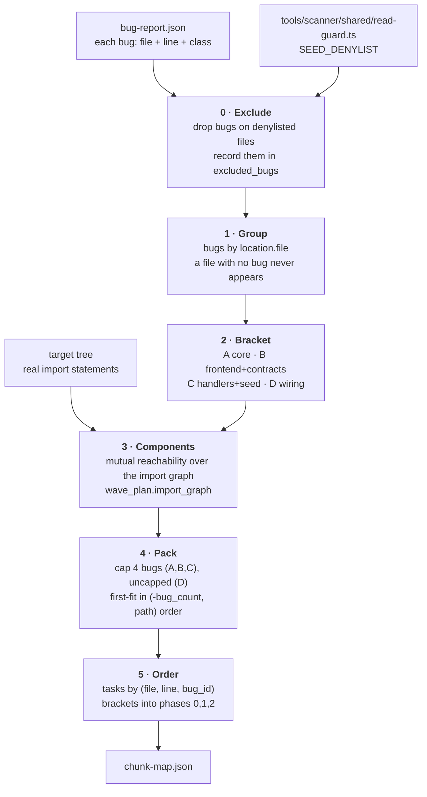

# The static chunk map: dividing the codebase once, offline

## What this is, and why it is not `wave_plan.py`

`src/wave_plan.py` schedules **one run**. It takes a bug report, layers its units
by longest path through the import graph, and emits waves. That is the right
shape for executing a run and the wrong shape for talking about the codebase:
every number in it moves when the bug list moves, so nothing in it can be agreed
on in advance.

This planner answers the other question — **which parts of this application can
be worked on independently, and in what order** — and it answers it with a
partition of the tree into four *brackets* that do not move when the bug list
does. A bracket is a claim about the application's architecture. A chunk is a
claim about one bracket's internal structure and about how much an agent should
hold at once.

The two planners share one dependency source of truth.
`build_chunk_map.py` imports `wave_plan.import_graph()`; it does not reimplement
it. Two copies of "what imports what" would drift, and the drift would be
invisible until a cycle was split across two chunks.

| | `wave_plan.py` | `build_chunk_map.py` |
|---|---|---|
| Unit | one file (bugs grouped by file) | one **bug** (task), packed into chunks |
| Ordering | longest path through the import DAG | fixed bracket phases |
| Stability | recomputed per report | brackets fixed; only the contents move |
| Output | `wave-plan.json`, consumed by `wave_runner.py` | `chunk-map.json`, a shared contract |

---

## The algorithm



### Step 0 · Exclusion comes first

`data/datacreator.ts` is on the scanner's `SEED_DENYLIST` because it enumerates
challenge keys. A patcher agent handed a bug there would read, in the course of
doing its job, the answers it is being scored against. Any bug whose file is on
the denylist is dropped before anything else happens: it appears in
`excluded_bugs` with its reason, it is in no chunk, and it is **not counted in
`bug_count`** — an excluded bug that still inflated the denominator would make
the run look worse than it was for a reason that has nothing to do with patching.

The list is **parsed out of `tools/scanner/shared/read-guard.ts` at generation
time**. It is not copied here, and the generator fails loudly if it cannot find
the array rather than proceeding with an empty one. A second copy of that list is
precisely how the original guard was missed: the v2 lane selector was forked
before the denylist moved into `shared/` and silently never picked it up, and two
runs' numbers were not blind as a result.

### Step 1 · Only files that carry a bug

A file with no bug never appears anywhere in the map. This is firm, and it is not
an optimisation: the map is a **work plan**, not an inventory. Every file listed
is a file some agent will be told to open, and listing a clean file puts it in a
prompt for nothing — extra context, extra tokens, extra surface for an
unnecessary edit.

### Step 2 · Brackets

| Bracket | Name | Paths | Phase |
|---|---|---|---|
| **A** | core | `lib/**`, `models/**` | 0 |
| **B** | frontend+contracts | `frontend/**`, `data/static/web3-snippets/**` | 0 |
| **C** | handlers+seed | `routes/**`, the rest of `data/**` | 1 |
| **D** | wiring | `server.ts`, `app.ts` | 2 |

**Rule order is load-bearing.** `data/static/web3-snippets/**` is tested before
`data/**`, or the smart contracts would fall into the handlers bracket and be
scheduled a phase later than the frontend they belong with.

A bug-bearing file matching **no** rule is an **error**, reported with the
offending paths, not quietly bucketed. Silently defaulting would place a file in
a phase nobody chose, and the map's ordering claim would then have no basis. The
fix is to add a rule and state which phase it belongs in.

All four brackets appear in the output even when a report puts no bugs in one, so
the shape of the artifact does not depend on the report. An empty bracket has
`concurrency: 0` and no chunks.

### Step 3 · Components, not files

Within a bracket, files that **transitively import each other** are one
component. A cycle means "these mutually depend", so no ordering between the
members exists to be scheduled, and they have to be edited as one thing.

Reachability is computed over the **whole** graph and only then restricted to the
bug-bearing files. A cycle that runs through a clean intermediate file is still a
cycle; restricting the graph first would hide it. In this target
`lib/insecurity.ts`, `models/user.ts` and `models/feedback.ts` are mutually
reachable, and they are one chunk in every map that contains them.

A file the graph does not know about — a `.sol` contract, anything under
`frontend/`, which `wave_plan` does not walk — reaches nothing and is its own
component. That is the honest answer: no import edge was observed.

### Step 4 · Packing

- **cap = 4 bugs** per chunk for A, B and C. **Uncapped** for D.
- Components are visited in **`(-bug_count, first file path)`** order.
- A component **at or above the cap** becomes its own chunk. It is already as
  much as an agent should hold; adding to it would only make the largest chunk
  larger.
- Everything smaller is **first-fit** into the earliest chunk that stays within
  the cap *and holds no oversized component* — so an 11-bug file is never quietly
  topped up to 12.
- Chunk ids are `<bracket><NN>`, numbered from `01` in packing order. Because
  packing walks components in a total order, the ids are a function of the
  inputs and not of anything incidental.

D is uncapped because the wiring files are one editing surface. Splitting them
would hand two agents adjacent lines of the same app bootstrap, which is the
collision the whole design exists to prevent.

### Step 5 · Order and phases

Tasks inside a chunk sort by **`(file, line, bug_id)`**. Granularity is
**bug-wise**: one task per bug, so a chunk of four bugs is four tasks even when
two share a file.

The `bug_id` tiebreak is load-bearing, not decoration. Two findings on one line
are common — three pairs in Subset 2 alone — and without it the order of those
tasks would be inherited from the order they happened to appear in the input,
which is not part of the input's meaning.

| Phase | Brackets | Why |
|---|---|---|
| 0 | A + B | the core, and a frontend/contract set that is genuinely disjoint from it |
| 1 | C | handlers call into the core, so the core lands first |
| 2 | D | the wiring should be edited against a tree where every other fix is in |

**A and B share a phase because it was measured, not assumed.** Against the real
tree the frontend and contract files have zero import edges to any server-side
file and none to each other — a test asserts it, so a future frontend file that
starts importing `lib/` fails the suite instead of silently making phase 0 unsafe.

Bracket concurrency is its chunk count. Phase concurrency is the sum over its
brackets.

---

## The current map

Generated from `tools/patcher/inputs/bug-report.json` (Subset 2, 24 bugs):

```
chunk map  bugs 24  chunks 4  brackets 4  phases 3  excluded 0

phase 0  brackets A+B  concurrency 1
  bracket A core                 1 chunk(s), no deps
     A01  7 task(s)  lib/insecurity.ts, models/feedback.ts     [import cycle]
  bracket B frontend+contracts   0 chunk(s), no deps

phase 1  brackets C  concurrency 2
  bracket C handlers+seed        2 chunk(s), after A,B
     C01  5 task(s)  routes/fileServer.ts                      [at the cap]
     C02  4 task(s)  easterEgg, metrics, premiumReward, updateUserProfile

phase 2  brackets D  concurrency 1
  bracket D wiring               1 chunk(s), after A,B,C
     D01  8 task(s)  server.ts                                 [uncapped]
```

Subset 2 puts no bugs in `frontend/**` or `data/**`, so B is empty and C is
routes only. That is a property of this report, not of the map: pass a wider
report and the same brackets fill out.

`subsets/subset-02.chunk-map.json` is this same map in the subset form the v3
dispatcher reads: bracket B dropped because it holds no chunk, phases renumbered
densely, and the `depends_on` edges naming B removed. Nothing else differs —
`test_subset02_map.py` asserts every surviving chunk is equal to its counterpart
here, so the generator still owns every id, file, line, class and reason.

---

## Regenerating

```
python3 tools/patcher/plan/build_chunk_map.py \
    --bug-report tools/patcher/inputs/bug-report.json \
    --out        tools/patcher/plan/chunk-map.json
```

`--tree` defaults to the report's `target_dir`. Any report conforming to
`tools/patcher/contracts/bug-report.schema.json` works — pointing `--bug-report`
at a wider report is the whole of what it takes to widen the map. Nothing about
the brackets, the cap or the phases is specific to Subset 2.

A test asserts the committed `chunk-map.json` is byte-identical to a fresh
generation, so a hand edit to the artifact fails the suite rather than surviving
as a silent divergence from the tool that owns it.

## Zones the map states rather than computes

These are properties of the target application, not of any bug report, so they
are constants in the generator and travel with every map because every chunk's
prompt needs them.

| Field | Meaning |
|---|---|
| `shared_extension_zone` | `views/**`, `config/**`, `swagger.yml` — writable by any chunk, but a write here must be **declared**. A correct CSRF fix measured in the Subset 3 pilot spanned four files to plumb a token into a template; forbidding these outright would silently restrict the solution space to whatever happens to be locally patchable. |
| `never_writable` | `test/**`, `**/*.spec.ts` — the gates. An agent that can edit the tests can pass them. |
| `read_denylist` | `models/challenge.ts`, `lib/antiCheat.ts`, `data/datacreator.ts` — not readable, not just not writable. Read from the scanner's guard, never copied. |

---

## Known limits

- **A cycle that spans two brackets is cut at the boundary.** The tree holds one
  14-file strongly-connected component straddling `lib/`+`models/` (bracket A)
  and `routes/`+`data/` (bracket C). Components are computed *within* a bracket,
  so its two halves land in different phases — an ordering the cycle does not
  support. The brackets are a fixed architectural partition and take precedence.
  A test pins this so it is a recorded cost rather than a surprise.

- **Bracket C is not edge-free, and the design note that said so was wrong
  twice.** The note this planner was built from states "no route file imports
  another route file (0 edges)". Measured against the tree there is exactly one
  direct route→route edge (`routes/metrics.ts` → `routes/vulnCodeSnippet.ts`),
  and one transitively *mutual* pair (`routes/vulnCodeFixes.ts` ↔
  `routes/vulnCodeSnippet.ts`, both ways through `lib/challengeUtils.ts` →
  `lib/antiCheat.ts`). The mutual pair is handled correctly — it is one component
  and therefore one chunk. The directed edge is not: see the next point. Both are
  pinned by tests, so a second edge fails the suite.

- **The map encodes no ordering *inside* a bracket.** Chunks within a bracket are
  a packing, not a schedule; two chunks in the same bracket are assumed
  concurrent. Where a directed intra-bracket edge exists, that assumption is a
  simplification, and the wave planner — not this map — is what respects it.

- **Import edges are static.** A runtime coupling with no import — a shared
  config key, a database column, an env var — is invisible here, as it is to
  `wave_plan`. The whole-suite gate is what catches those.

- **cap = 4 is a judgement, not a measurement.** It is the one number in this
  planner that no evidence yet supports. Changing it changes chunk count and
  therefore concurrency; it is a single constant (`CAP`) so the trade can be
  measured rather than argued.

## Files

| File | Role |
|---|---|
| `build_chunk_map.py` | the generator: exclusion, brackets, components, packing, render |
| `chunk-map.json` | the generated map for Subset 2 — regenerate, never hand-edit |
| `../tests/test_chunk_map.py` | the partition invariants, the exclusion, determinism, and the structural facts above |
| `../src/wave_plan.py` | `import_graph()` — the single source of truth for imports |
